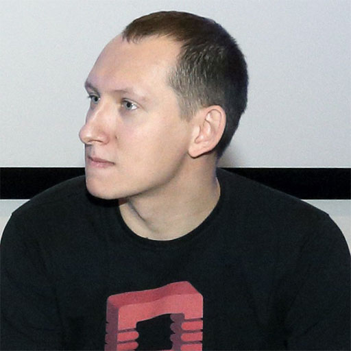

> «...Я называю отражение мозга специальным словом — Гзом. Это скорее прозвище, нежели научный термин. Гзом — это разум среды. И мозг, в свою очередь, есть отражение Гзома. Мы на самом деле мыслим не мозгом. Мы мыслим Гзомом».
> 
> _Сергей Ануфриев, Павел Пепперштейн, «Мифогенная любовь каст»_

Название проекту мы дали не только в знак уважения к одному из самых причудливых и увлекательных русских романов конца XX века. Язык поистине отражение мозга, точнее, мышления. И, разбираясь в языке, его носитель лучше понимает, кем является и кем становится.

Мы не новостное СМИ. Равно как и не справочная служба наподобие ценимой нами «Грамоты.ру». За нормативными указаниями не к нам. Мы объясняем, почему именно лучше так, а не иначе. Да, мы прибегаем в том числе к академическим источникам и умеем аргументированно доказывать свою точку зрению, но с нами уместно спорить — по существу вопроса.

Наш выбор — explanatory journalism. У нас нет дидактических позывов, ну а снобизм свой мы стараемся держать на коротком поводке, как Сальвадор Дали — муравьеда во время прогулок по улицам Парижа. Нам хочется вовлекать вас в путешествие мысли. Не столько даже «учить всему шутя», сколько предлагать познавательное приключение как отдельную, ценную саму по себе цель.

От сих и, надеемся, до бесконечности мы будем рассказывать вам про то, как работает язык и как работают с языком, почему говорить так — здорово, а вот так — не здорово, когда нейросети научатся сочинять стихи в духе Летова, а не симулировать красный смех, какие потаённые смыслы русской культуры раскрываются вангоговскими подсолнухами в хип-хоп-баттлах и почему «вангоговский» пишется слитно.

Стремясь к исследовательской беспристрастности, мы не претендуем на бесстрастность. На наших страницах будут и выдержанные в нейтральном стиле мануалы, и авторские колонки, от которых у кого-то бомбанёт, а у кого-то сделается теплее на сердце. Будут короткие заметки о правилах русского языка и лонгриды о нейропсихологии. Мини-обзоры новейшего сленга и FAQ по изучению иностранных языков с помощью сериалов.

Площадка создана на собственные средства основателей и на текущий момент ни с кем и ни с чем не аффилирована. Зато мы готовы размещать рекламные блоки, делать спецпроекты и вступать по взаимной приязни в иные коммерческие отношения с теми, кто выпускает достойные товары и оказывает клёвые услуги.

Темы для статей и предложения по ускоренному превращению «Гзома» в боевого слона с титановым экзоскелетом присылайте нам на info@gzom.ru, мы постараемся ответить каждому.

## Что ж вы за люди-то такие?

### Михаил Боде, главный редактор

С 2003 года редактирует и пишет тексты. Иногда света белого не видит, отчего, вероятно, и решил заняться просвещением сам. Работал в журналах Upgrade и «Секрет фирмы» и на портале Drive.ru, руководил онлайн-каналом SeoPult.TV, сотрудничал с издательством «Манн, Иванов и Фербер». Стараниями добрых, но легкомысленных людей пристрастился к интернет-маркетингу. Медиаджанки. Зависимость отрицает. Утверждает, что слово «медиаджанки» орфографически омерзительно и его вписал сюда не он.

### Василий Борисов, IT-прораб

- Больше 20 лет красноглазит за мониторами и нажимает кнопочки на клавиатуре.
- Тянул OS/2 с BBS, регулярно забирал почту с CM ноды FIDOnet, починял примус, а потом случился интернет, и всё заверте...
- В 2000-х был фрилансером. Потом работал в поддержке Infobox, человеком-оркестром IT-проектов в Selectel.
- Единицей измерения себя считает гиковатт.