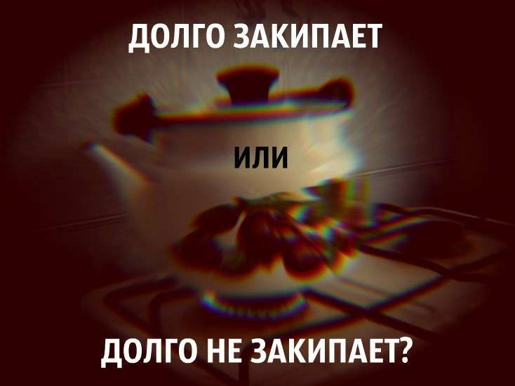

«Чайник долго закипает» и «Чайник долго не закипает»: почему эти фразы в речи взаимозаменяемы?

Вы донимали в школе учительницу русского вопросами вроде «Почему „Чайник долго закипает“ и „Чайник долго не закипает“ означают одно и то же?». Я не донимал: было ясно, что и ей, скорее всего, не ясно. Однако такими-то «фокусами» живая речь и занимательна. С виду правда фокус. Отрицание производит конструкцию не противоположную, а тождественную исходной, и означают обе одно и то же. На деле — почти одно и то же. А секрета никакого нет. Есть стечение грамматических закономерностей, делающее тождество возможным.

Как в русском, так и в других языках бытует так называемое **незначащее**, или поверхностное, **отрицание**. Сравните:

> У вас есть зажигалка? ≈ У вас нет зажигалки?  
> Ты дашь мне криптонит? ≈ Ты не дашь мне криптонит?

Хотя эти фразы различаются между собой модальностью, посылом, наличием побудительного оттенка. В частности, варианты справа, «У вас нет зажигалки?» и «Ты не дашь мне криптонит?», с одной стороны, подспудно предлагают собеседнику возможность отрицательного ответа, с другой — именно они отчётливо выражают просьбу.

Подобная синонимия внешне обратных друг другу слов или выражений близка к явлению **энантиосемии**, то есть совмещению противоположных значений в одном слове. Например, фраза «Вадим прослушал лекцию» вне более широкого контекста может с одинаковой вероятностью означать, что:
- Вадим слушал лекцию и воспринимал слова преподавателя;
- Вадим слушал лекцию невнимательно и не уловил её содержания.

«Чайник долго закипает» и «Чайник долго не закипает» описывают одну ситуацию, однако с разных ракурсов. Несмотря на то что глагол использован в одной форме — несовершенный вид, настоящее время, — в первом случае акцент сделан на длительном процессе: «Чайник долго закипает» ≈ «Вода в чайнике на протяжении [чересчур] продолжительного периода времени **доходит** до фазы настоящего, бурного кипения».

Во втором же случае подразумевается другое действие — сам переход, начало кипения. Примерный смысл: «Воде в чайнике на протяжении [чересчур] продолжительного периода времени **не удаётся совершить** перехода к бурному кипению». В норме оно выражается через второй член видовой пары «закипать — закипеть»: «Чайник закипает» и «Чайник закипел». Здесь употреблён глагол в совершенном виде, который обозначает законченный акт. Мы имеем дело, в терминах замечательных лингвистов А. А. Зализняк и А. Д. Шмелёва, с **обязательной имперфективацией**. Что же, по уму, в предложении «Чайник долго не закипает» глагол должен иметь совершенный вид? Нет.

В русском есть такая штука, как **имперфектив отрицания**: в отрицательном контексте совершенному виду свойственно уступать место несовершенному (при передаче законченного действия). Не всегда и не везде, но часто. Сравните: «Григорий подписал себе приговор» и «Григорий не подписывал себе приговора», «Чайник в полдень закипел» против «Чайник в полдень не закипал».

Задайся мы целью сохранить совершенный вид, могли бы сказать: «Чайник всё никак не закипит», «Чайник долго не может закипеть». Однако речевая ситуация потворствует тому, чтобы мы говорили о ней в настоящем времени в обоих случаях.

Кроме того, совсем упрощённо говоря, мы часто используем глаголы несовершенного вида в настоящем времени, где в норме обозначаемые ими действия передаются глаголами совершенного вида в прошедшем времени: «Тут беру я его за грудки и вижу — сдулся» ≈ «Тут взял я его за грудки и увидел — сдулся». Суть в том, что подобные замены принципиально возможны.

Эти грамматические тенденции, накладываясь друг на друга, и делают возможным такой языковой фокус, которые оказывается вовсе и не фокусом. Но надо сделать оговорку: такое близкое смысловое схождение характерно для **некоторых** глаголов **нескольких** типов, в частности:
- выражающих переход в некое состояние (<em>остывать</em>, <em>высыхать</em>, <em>закипать</em>);
- ментальных (<em>решаться</em>).

Напоследок — как раз про случай с «решаться»:

> Чаще всего форма несовершенного вида \[глагола «решаться»] употребляется с отрицанием и при этом также обозначает концептуально выделенное состояние нерешимости («Ну как, вы все не решаетесь принять его предложение?»); таким образом возникает парадоксальная энантиосемия, когда один и тот же глагол с отрицанием и без отрицания значит почти одно и то же: «долго решался войти» ≈ «долго не решался войти». Ср.: «Я долго не решалась писать к тебе, — в продолжение двух месяцев каждый день я бралась за перо и бросала его…» [≈ «долго решалась написать к тебе…»\] (Панаев); «Немало времени, немало убеждений и просьб стоило Марье Ивановне, чтоб уговорить Дуню идти в столовую и познакомиться с Денисовым. Долго не решалась Дуня, наконец пересилила себя — пошла» \[≈ «долго решалась, наконец пересилила себя — пошла»\] (Андрей Печерский).
> 
> Впрочем, определённое семантическое различие между формами без отрицания и с отрицанием всё же наблюдается. Выражение «долго решался» в большей степени предполагается некоторый внутренний процесс, когда субъект собирается с духом, прежде чем предпринять решительное действие, тогда как «долго не решался» скорее указывает на состояние, когда субъект ещё никак не готов к действию и, скорее всего, ещё не начал процесс внутренней подготовки к действию.
> 
> _А. Д. Шмелёв, «Видовая корреляция в толковом словаре»_