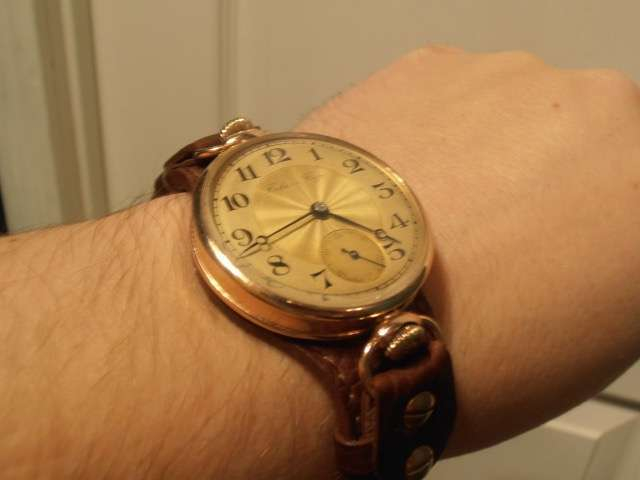

Где в «Ководстве», рассуждая о русском языке, Артемий Лебедев дал промашку.

Разбираемся, как Артемий Лебедев сумел убедить пол-Рунета в своей негативной трактовке одного занимательного грамматического явления и как правильно в действительности.

Образцовый, без дураков, отчим хорошего дизайна, Артемий Лебедев с его склонностью воспринимать знание через призму эстетики любит русский язык. По-своему. Я не издеваюсь. Издеваюсь я иначе. Издевался бы — включил бы Хармса. Например: «Артемий Лебедев любил русский язык…»

Но Тёма родную речь точно любит, и его наверняка воротит от словосочетания «родная речь» в качестве замены «русскому языку». Меня тоже. Выражусь ещё гаже, под стать белому воротничку с пятьюдесятью оттенками серого: язык он «любит активно», постулируя в позиции сверху правомочность или недопустимость того или иного явления — в орфографии ли, в пунктуации ли.

За вдалбливание азов типографики в черепа веб-мастеров и верстальщиков я охотно поднёс бы ему бокал пуэра. Но шаг-другой в сторону от издательского и оформительского дела, к семантике и морфологии, и частенько он теряет ориентиры, опираясь лишь на свой магический посох, чьё имя в приблизительном переводе с эльфийского — «Я художник, я так вижу». Тогда другая «каряя вода в тот след стремится».

### Предлог не нужен?

В § 114 своего «Ководства» — полезнейшего большей частью пособия для красоты по выживанию в некрасивом мире — Тёма, чередуя регистры памфлета и мануала, [рассуждает](https://www.artlebedev.ru/kovodstvo/sections/114/) о гримасах «корпоративного русского». Почти во всём — исходя из разумных посылок. Однако в подразделе «В поисках предлога» припечатывает:

> «Предлог „от“ не может выступать в качестве обозначения причастности. Не костюм от „Армани“, а просто — костюм „Армани“. Кстати, в статье упоминается „Недоросль“ Фонвизина, хотя от г-жи Вишневской мы вправе ожидать „Недоросль“ от Фонвизина. <…> Украшения от „Картье“, унитаз от „Версаче“ и шоколад от „Линдт унд Шпрюнгли“ бывают, когда нам на почте говорят, от кого пришли бандероли. Но биомеханоиды родную речь забывают, а слова становятся несклоняемыми, как рёбра жесткости».

Оставим за скобками жёсткость как уничижительную характеристику грамматической конструкции: раздавать такие определение сродни попыткам высечь море плетьми, а главное, флективный по природе, русский язык вне зависимости как от моего, так и от вашего представления о нём несёт в себе аналитические тенденции, в том числе — к несклоняемости. Ничуть не более безумен, а то и более внятен был бы контраргумент, что Данте в «Божественной комедии» чувствовал себя ‘ben tetragono ai colpi di ventura’ — «добрым кубом, стойким к ударам судьбы». Куб же. С твёрдым основанием же. По флорентийскому хардкору же.

Это вообще одно из самых загадочных мест «Божественной комедии». Переводчики из века в век передают его иносказательно хотя в основе верно. Например: «К ударам рока я готов». А Хорхе Луис Борхес в эссе «Семь вечеров» фантазирует об источнике выражения: «В одной из книг по геометрии Данте прочёл, что куб — самое крепкое из тел. <...> Данте пользуется им как метафорой человека, который должен претерпеть удары судьбы.

Малопонятно и как предлог делает несклоняемыми те имена собственные, которые даны в примерах и хоть с ним, хоть без него в русском языке не изменяются по падежам, а также чем должно быть обидно прозвище «биомеханоид» в свете близящейся технологической сингулярности.

Шут бы с ними, с фантазиями про рёбра жесткости и прочую инженерию. Ранит меня в сердце первая фраза: «Предлог „от“ не может выступать в качестве обозначения причастности». Потому что она не кружева вымысла, каких километры у французских структуралистов и светских колумнистов, а туфта. Ошибка, и по незнанию ли допущенная, безразлично.

### Прости, Тема, мы всё про… верим

От неквалифицированных утверждений о языке, особенно когда им начинают стадно следовать наравне с каноническим Розенталем, опускаются руки. Но попробуем их поднять. Без дробовика или гипноза. Лишь силой лингвистики и здравого смысла. Будет не так просто, как у Тёмы, зато с аргументацией.

Во-первых, не следует путать причастность и принадлежность. Шутя о «„Недоросле“ от Фонвизина», автор «Ководства» подразумевает как раз таки принадлежность, в лингвистической терминологии — посессивность (от лат. _possessiō_ — «обладание»). Но даже и прямая принадлежность в русском языке выражается не только через родительный падеж без предлога.

В «Справочнике по правописанию и литературной правке» Д. Э. Розенталя чрезвычайно доступно сформулировано то, что более въедливо объясняется в академических грамматиках: «Обычно предложные конструкции, в которых отношения между словами выражаются не только падежным окончанием, но и предлогом, имеют более конкретный характер, связь между словами уточняется». Сравните: «Дом полковника стоял на отшибе» и «Дом у полковника стоял на отшибе». Оцените, как расставлены в двух фразах акценты. Вне контекста различия рельефнее. Во второй, с одной стороны, усилен фокус на персоне владельца, с другой — заострён сам факт обладания.

Во-вторых и в-главных, обороты вида «костюм от Armani» обозначают именно причастность — не принадлежность. Притом причастность со значением отъединенности объекта от породившего его начала. Ведь костюм Armani не принадлежит производителю Giorgio Armani S.p.A., хотя носит его «титул». Мы в таком случае имеем дело — ещё одно страшное слово — с сурсивом.

По другой трактовке, которая изложена в защищенной в ННГУ им Н. И. Лобачевского диссертации с зубодробительным заглавием «Предложно-падежные конструкции с предлогом „от“ в современном русском языке: структурно-семантический аспект», все эти «сумочки от Gucci» и «пельмени от Палыча» подпадают под категорию — задержите дыхание — «компонент со значением посессивного субъекта-отправителя, владельца отчуждаемого предмета или качества». Попросту: некто создал предмет — и тот переходит к новому собственнику, сохраняя свое происхождение. Согласитесь, если галстук на шее у Серафима изготовлен под маркой Ermenegildo Zegna, то галстук всё же — Серафимов. Его обладатель — Серафим, а не итальянская фирма.

Вернее, справедливости ради надо заметить, что в научной работе примеры даны не из сферы брендов. Но функционально очень близкие к интересующим нас, несмотря на разницу в реалиях: _Наш дом от завода Ильича (А. Вознесенский)_. Перефразируя Тёму, надо бы сказать: «Дом „от завода Ильича“ бывает, когда нам на почте говорят, что пришла бандероль от предприятия, переключившегося на выпуск советского аналога LEGO». Шутки шутками, но это всё равно что на вопрос «Кто последний в очереди?» шаблонно скаламбурить: «Последним бывает только путь, а крайний я». Не надо так.

В-третьих, бытует мнение, будто обминаемая нами со всех сторон конструкция закрепилась в устной и письменной речи под влиянием «от-кутюр» — кальки с haute couture (фр. «высокая мода»). Якобы по аналогии с «платьем от-кутюр» к концу перестройки — началу 1990-х начали говорить и писать «костюм от Armani». Однако сомнительно, чтобы одно заблуждение, в кратчайшие сроки по принципу домино распространившись и в бытовом обиходе, и в медиа, создало новую модель предложного управления. Ни с того ни с сего.

Сомнительно, но возможно. Казусы из разряда «оттого, что в кузнице не было гвоздя» в языке случаются, подобно тому как слово «зенит» возникло из-за ошибки переписчика, который передавал латинскую транскрипцию арабского термина _samt ar-raʾs_ (_m_ развалилось у него на две буквы — _n_ и _i_). Хотя львиная доля таких ошибок была обусловлена «бутылочными горлышками» догутенберговской эпохи, когда один-единственный человек мог внести искажения в рукописный текст и некому было их исправить.

В современном же языке закрепляется надолго то, к чему в нём существуют предпосылки. Скверно ли, благодатно ли новое — вопрос, лежащий за пределами языкознания, или, научно говоря, экстралингвистический. Так что, вероятнее всего, к «костюмам от Armani» русский предрасположен грамматически. Либо новое — это и впрямь хорошо забытое старое.

Правильнее только будет сказать не «либо», а «кроме того». Достаточно нырнуть в корпус беллетристики и публицистики XIX — начала XX века, как обнаруживается целая россыпь оборотов, скроенных ровно по той же модели; задолго до учреждения фирмы Armani. В числе прочего — у классиков.

> «Подле тяжелого буля стояла откидная кушетка от Гамбса, высокий готический камин прикрывался ширмами с картинами фоблазовских нравов, на столах часто утро заставало остатки ужина, на диване можно было найти иногда женскую перчатку, ботинку, в уборной его — целый магазин косметических снадобьев».
> 
> _И. А. Гончаров, «Обрыв» (1869)_

> «Веруня постояла, посмотрела ей вслед, вздохнула ― и начала с большим усилием надевать пышное и тугое песочное платье от Claire».
> 
> _З. Н. Гиппиус, «Без талисмана» (1896)_

> «..про рысаков, экипажи, костюмы от Ворта…»
> 
> _В. М. Дорошевич, «Седые волосы» (1906)_

> «И вот, по странной игре судьбы, у самого что ни на есть племенного „человека без часов“ появились в кармане золотые, с двумя крышками и чуть ли не от Буре»
> 
> _Анатолий Мариенгоф, «Роман без вранья» (1927)_

Заметили, что общего в цитатах? Источник «отчуждаемого предмета» — фешенебельный, элитарный или, как бы сказали сегодня, «премиальный». Имя, которое само по себе знак качества.

Вспомним Розенталя: благодаря предлогу «связь между словами уточняется». Здесь — усиливается персонификация, с оттенком уникальности объекта. «Чуть ли не от Буре».

Неудивительно, что в советском изводе нормативного русского языка — за вычетом карикатурной стилизации речи под дореволюционную — эта форма предложного управления вышла из активного употребления. Свернулась на периферии до поры до времени, пока не понадобилась снова.

Разница между «платком Hermès» и «платком от Hermès» — семантико-стилистическая. Там, где важно охарактеризовать персону через её вещные атрибуты, через «статусное обладание», второй вариант гораздо уместнее. Между тем «вертолет AS-365 Dauphin II от Eurocopter France» звучит диссонирующе, только если контекст не брызжет иронией: серийный летательный аппарат — штука утилитарная. Скорее уж «вертолет AS-365 Dauphin II производства Eurocopter France».

В конце концов, употребление предлога бывает и смыслоразличительным: как понять, «духи Armand Basi» — название марки или наименование отдельного аромата?

Забавно, что конструкция «что-либо от кого-либо» в значении «товар, произведённый кем-либо» или «предмет, созданный кем-либо», как мы удостоверились, укоренилась в нашем речевом обиходе не из-за одной досадной ошибки. Зато убедить широкие народные массы — и даже часть узких профессиональных — в ущербности оборота сумел один-единственный человек. Из лучших побуждений. Так что давайте говорить друг другу аргументы. Ведь мы друг другу тут не только консументы.