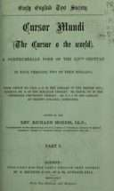
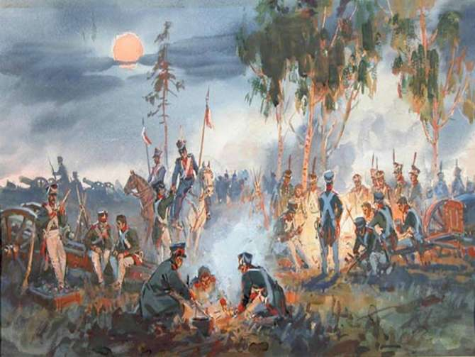

Склонить ли голову перед требованием склонять топонимы на -о?

Грамотность — явление интегральное, как выразился бы инженер. Или, как сказал бы вятский крестьянин из XIX века, дюже закомуристое. Её уровень нельзя замерить по двум-трём «пробам грунта». Например, по тому, произносит некто «грéнки» или «гренки́». Но хочется. Так разнородные трудные случаи орфографии и пунктуации превращаются в маркеры, по которым принято определять, насколько владеет языком собеседник. Среди них и склонение топонимов славянского происхождения, оканчивающихся на гласный «о».

«В Бирюлёво» или «в Бирюлёве» — вопрос лукавый. Блюстители строгой литературной нормы ратуют за второе. Формально они правы. Были бы. Лет пятьдесят-шестьдесят назад. На поверку всё сложнее.

Тенденция к тому, чтобы не склонять топонимы среднего рода на _-о_, устойчива. Но перед нами лишь частный случай того, как усиливается аналитизм в русском языке. Просто заметный: городов, сёл, районов, названия которых оканчиваются на _-о_, великое множество, в них живут люди, и людям этим небезразлично, как своё место жительства называть. Да и в заголовках разнобой. Он бросается в глаза: «В Чертанове установили памятник любимой овце-вампиру Ивана Грозного» против «В Ховрино открылся филиал Института прикладного шаманизма».

> Упрощённо: аналитизм — строй языка, при котором грамматические значения передаются с помощью служебных слов и за счёт самого порядка слов. Синтетизм — это когда значения реализуются через изменение самой формы слова: приставки, суффиксами, окончаниями и т. д. В русском языке аналитизм и синтетизм сочетаются. **«Более сложный»** — форма аналитическая. **«Сложнее»**, **«посложнее»** — синтетическая. Часто существует лишь аналитическая форма, например **«одержу победу»**. 

Лингвисты лишь фиксируют изменения, происходящие с языком (как глобальные, так и точечные), и оговаривают, насколько те сообразны общим линиям, вдоль которых он развивается. Сначала между условными «в Пушкине» и «в Пушкино» произошло разделение сфер употребления в функциональном и стилистическом отношении. Теперь оно почти что стёрлось.

> Географические названия на _-ово, -ево_ и _-ино, -ыно_, как то: _Иваново_, _Бирюлево_, _Кунцево_, _Сараево_, _Болдино_, _Бородино_, _Голицыно_ и подобные, — в современной разговорной, профессиональной, газетной речи обнаруживают тенденцию к неизменяемости. Несмотря на это, в письменной речи, в соответствии с действующими грамматическими правилами, географические названия на _-ов(о), -ёв(о), -ев(о), -ин(о), -ын(о)_ склоняются:  
> _В небе над Тушином_ (газ.); _Речь идет об аэропорте в Шереметьеве_ (газ.).
> 
> Несклоняемость географических наименований нормальна в следующих случаях:
> 
> - Если такое наименование является приложением к одному из следующих обобщающих слов: _село, деревня, посёлок, станция, становище,_ реже — _город_: _в селе Васильково, в посёлке Пушкино, в деревне Белкино, на станции Гоголево_.
> - Если населённый пункт назван собственным именем известного лица: _около Репино_ (назв. посёлка под Ленинградом), _недалеко от Лермонтово_ (назв. небольшого города около Пензы)».
> 
> _«Русская грамматика — 80»_

Уже без малого сорок лет назад академическая грамматика подтвердила соперничество двух норм, о котором учёные-филологи и профессионалы редакторского дела писали и прежде. Однако к концу XX века возобладала норма новая.

> Свидетельством нарастания аналитических черт в грамматике русского языка является несомненный рост несклоняемых имен во второй половине XX в. Речь идет прежде всего о географических названиях на _-ин(о), -ое(о)_. Названия типа _Пушкино, Ефремово, Салтыково, Бутово, Разине, Старбеево, Шереметьево_ и т. п. давно уже идут в направлении несклоняемости. Об этом свидетельствуют исследователи, данные массовых обследований, язык периоди­ческой печати. Вопреки этой очевидной тенденции долгое время редакторы и корректоры, следуя указаниям грамматик и справоч­ников, авторы которых продолжали охранять традиционные скло­няемые формы, пытались задержать процесс в литературной прак­тике. Однако тенденция оказалась достаточно сильной, и функционирование несклоняемых форм постепенно стало массовым. В своде правил орфографии это уже зафиксировано официально.
>
> _Н. С. Валгина, «Активные процессы в современном русском языке» (2001)_
  
  

Когда вместо внятной аргументации меня тыкают в одну и ту же строчку Лермонтова «Про славный день Бородина», я в ответ рекомендую учить английский по Cursor Mundi — замечательнейшему литературному памятнику XIV века.        

> Учитывая динамику и активность процесса закрепления в речи топонимов в неизменяемой форме, практическая стилистика санкционирует такое их употребление в разговорной речи, в специальной литературе, не рекомендуя, однако, несклоняемые формы для строгого литературного употребления.
> 
> _И. Б. Голуб, «Стилистика русского языка» (1997)_
        
Предпосылок к тому было много. Одна из наиболее очевидных: от косвенных падежей бывает затруднительно восстановить исходную форму имени собственного. Допустим, написано: «В Пушкине открылся Музей виноградных улиток». Вне более широкого контекста не понять, какой населённый пункт подразумевается — Пушкин или Пушкино. Собственно, из языка картографов и военных, с их потребностью передавать наименования точно, без разночтений, несклоняемость, предположительно, и проникла в устную и письменную речь.

«Так уродливо и неестественно». Нет. Вернее, вкусовщина тут правит бал. Открываем «Горе от ума»: «Я должен у вдове, у докторше, крестить». Уродливы ли эти падежные формы? Нисколько. Они отражают старую грамматическую норму, а именно диалектные формы родительного падежа на _-е_, свойственные в XVIII–XIX веках речи москвичей. Это отголосок морфологических процессов, которые проистекали ещё в древнерусском языке, рудимент старой парадигмы склонения существительных. Хотя напиши кто сегодня: «Я должен у вдове забрать фотографии», — и его в лучшем случае упрекнут в опечатке. Тогда как несклоняемая часть в «изысканных бонмо» и «детях индиго» мало кого смущают.

> Я не утверждаю, что правильно не склонять такие топонимы. Просто нам довелось застать на своём веку наложение двух равноправных норм. И началось оно не вчера.

В послевоенной литературе встречаем:

> Домик в Пушкино, 64.
> 
> _Анатолий Рыбаков, «Кортик» (1946–1948)_

> Летом сняли дачу в Пушкино, под Москвой.
>
> _Л. Ю. Брик, «Из воспоминаний» (1956–1977)_

Хотя колебания в выборе падежных форм (склонять ли? не склонять?) наблюдались и до революции, и в ранние годы советской власти:

> После Талежской школы А. П. устроил школу и у себя в Мелихово.
> 
> _«Из анекдотов о Чехове» («Утро России», 1910)_

> В ответ на мои посылки я получал из Пушкино похвалы моей работе.
>   
> _К. С. Станиславский, «Моя жизнь в искусстве» (1925–1928)_

> ― Вспомнил! Вспомнил! В Пушкино открылась чебуречная «Ялта»! Всё понятно!
>  
> _М. А. Булгаков, «Мастер и Маргарита» (1929–1940)_

Склонять или не склонять подобные топонимы — **выбор того, кто несёт ответственность** за площадку, книгу, презентацию, где напечатан текст. И каким бы выбор ни был, он не свидетельствует ни о грамотности редактора или автора, ни о его безграмотности. Главное — держаться принятого решения. Так, в первом случае изменять эти названия по падежам придётся последовательно и без исключений.

**Именительный падеж:** _гордое Восточное Бирюлёво_  
**Родительный:** _из гордого Восточного Бирюлёва_  
**Дательный:** _гордому Восточному Бирюлёву_  
**Винительный:** _в гордое Восточное Бирюлёво_   
**Творительный:** _с гордым Восточным Бирюлёвом_  
**Предложный:** _о гордом Восточном Бирюлёве_

В пределах одной книги, одного издания, одного пособия должна действовать одна норма. Моё сугубо частное мнение: в документальной прозе о жизни и творчестве Антона Павловича Чехова с лёгкой стилизацией под старину название его усадьбы, пожалуй, уместнее склонять; «В Мелихове писатель прожил семь лет». А вот от заголовка «В Восточном Измайлове гигантский крот угнал трамвай» меня колотит, и не из-за дикой фабулы. Но и это, повторюсь, субъективно: так уж откалибрована моя редакторская оптика.

«Окостенение» ранее склонявшихся слов — больная мозоль пуристов, подобно другим проявлениям аналитизма, включая сокращение числа падежей. Почему-то в массе своей люди уверены, что развитая падежная система — один из главных признаков богатства языка. Между тем в большинстве индоевропейских языков с давней историей падежи постепенно «отсыхали» один за другим, уступая место иным выразительным средствам грамматики.

Так что несклоняемость топонимов среднего рода на -о не заслуживает ни яростной филиппики, ни самоотверженной апологии. Просто она становится всё более распространённой — в русле обширной языковой тенденции, а не по неграмотности народа. Things will happen while they can, как пели Alphaville.