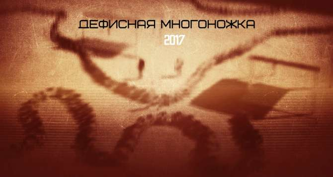

Как устроены и зачем нужны языковые конструкции, «собранные» с помощью нескольких дефисов.

«...Пишу для-себя-любимого. Писать-чтобы-удивить не моё кредо». Перечитал, и от избытка дефисов мне сделалось гадко до зуда в носу, как если бы к тонкой подошве ботинка приклеилась жвачка, в той застрял острый камешек, ан надо шагать без остановки. А иногда и к месту, и чудесно, и «бередит сердца». Не все дефисные склейки такого сорта неискоренимо плохи. Только, находясь в русском языке на полулегальном положении, они требуют и чуткости и строгости. Где тонко, там и рвётся смысл.

Откуда это нанизывание? Загадочным поветрием распространение конструкций вида «ни-уму-ни-сердцу книжка» не объяснишь. Тут не скоротечная речевая мода, не цепкий мем-репей, а целая, так её растак, семантико-синтаксическая модель, которая, с одной стороны, скроена по заграничной мерке, с другой — совпадает с общей тенденцией развития русского языка, иначе оставаться бы ей в пределах переводного худлита.

Видится мне, она из английского, с его аналитизмом: когда большая часть грамматических признаков в языке выражается через сам строй предложения и служебные слова, отдельные части словосочетания или даже более крупного фрагмента, обозначающего некое понятие, либо явление, либо действие, при благоприятных к тому условиях норовят слипнуться.

‘I didn't mind being asked of what had been done to Mr. Fulton’, или «Я не возражал бы, если бы мне был задан вопрос, что сделали с мистером Фултоном» (пример от балды). Здесь придаточное предложение — всё, что после предлога of, — словно тяготеет к тому, чтобы встать вровень с каким-то одним фантомным существительным: _what had been done to Mr. Fulton ≈ the incident [with Mr. Fulton]_. Правда, не встаёт.

А бывает, трансформации таки происходят: ‘This may seem petty, but it is part of the other-than-reality-based world’, или «Казалось бы, мелочь, но это часть мира, отличного от того, что опирается на реальность» (Time, октябрь 2012 года). Оборот _the other than reality-based [world]_ превратился в сложное прилагательное, неустойчивое, но возникшее ровным счётом ввиду стремления к устойчивости.

Правила русской орфографии и пунктуации 1956 года не содержат ни малейшего намёка на существование подобных конструкций, так же как, впрочем, не отражают и десятков иных случаев, часть из которых (не все, но многие) разъяснил в «Справочнике по правописанию и литературной правке» Д. Э. Розенталь. Впрочем, эта чурчхела с дефисной нитью и сегодня-то нормой не является. Она всегда — из ряда вон. Нет, простите: из-ряда-вон.

В нашем языке «многоперемычность» редка. Общеупотребительна разве только в заимствованиях сложных географических названий и других имён собственных: _Шатильон-сюр-Эндр, Франкфурт-на-Майне_. На худой конец, «Мальчик-с-Пальчик», хотя такое написание устаревает, уступая место «Мальчику с пальчик». Среди имён нарицательных, тем более исконно русского происхождения, таких исключений считанные единицы: _перекати-поле, иван-да-марья_.

Тем не менее «серийный дефис» закрепляется в русском, хоть пока и на периферии. Я различаю у него по меньшей мере семь устойчивых функций (они могут сочетаться друг с другом); возможно, вы сумеете выделить и иные.

### I

Синтаксический компрессив в чистом виде _(linguo-geek mode on. — **Прим. ред.**)_, а-ля: «Возьму гироскутер, крем от загара, дробовик и-что-там-ещё-потребуется», «Давай, проповедуй!.. Ты ж видишь жизнь-как-она-есть». Бывает, даёт +10 к иронии. Бывает, просто о’кей. Бывает, полное днищеанство.

Часто подчёркивает англифицированность оборота или текста в целом.

### II

«Кто-во-что-горазд». Слипаются ещё плотнее устойчивые обороты. Моё мнение: разлеплять, и вне зависимости от жанра и формата текста. В отсутствие веских логических и творческих доводов в пользу противоположного выбора.

### III

Всякие «э-э, ну-что-вам-сказа-а-ать, чита-ать-от-сих-до-си-их», передающие слитность речи, её монотонность. Парцелляция, напротив, показывает прерывистость реплики с нажимом на каждое слово: «Читать. От. Сих. До. Сих» или «Читать. От сих. До сих. Ккканальи!» И точно так же, как парцелляция, приём чаще всего некстати.

Или, наоборот, дефисный пунктир ускоряет внутренний темп речи, одновременно заостряя внимание читателя на фрагменте: «Рощин-в-будущем-Сапожник, в отличие от собратьев, томился от переполнявших его мыслей, не относящихся прямо к делу» (с почившего в бозе OpenSpace.ru).

Сравните: «Гришутка — актёр-писатель-видеоблогер-медиаконсультант — второй год жил на дошираке» против «Гришутка — актёр, писатель, видеоблогер, медиаконсультант — второй год жил на дошираке». В первом случае ирония рельефнее: нормальные профессии сливаются в одну не-профессию, пародию на профессию.

### IV

«…Приходилась прапра-не-упомнишь-сколько-прабабкой» (Джулиан Барнс, «Англия, Англия»). Особый случай, когда подобная конструкция вогнана в какое-то слово, и отчасти дефисное написание здесь служит для имитации слогоделения.

### V

Копируются существующие формы двухдефисного написания сложных слов, закрепившиеся в русской орфографии. Например, «стыд-и-срам» — по аналогии с совершенно нормативным, ранее упомянутым «иван-да-марья». Или конструкция даётся в параллель со словом, написанным через две чёрточки в полном соответствии с правилами: «Это не разудалый рок-н-ролл. Это погребальное иди-и-смотри».

### VI

Синтагма тщится переродиться в одну квазиноминативную единицу. Хоп — и я сам ошалел от сказанного. По-понятному: словосочетание притворяется одним словом. Что-нибудь вроде: «Сидение-в-тени-можжевельника» (смахивает на попытку передать многозначный китайский иероглиф с акцентом на нерасторжимости понятий в составе единой идеограммы), «труд-как-лекарство».

### VII

Случай, когда «шампуринг» слов сопровождается другими, в том числе синтаксическими и морфологическими, модификациями, например конверсией в другую часть речи с принудительным окказиональным добавлением склоняемости: «Ну и утешались кто-во-что-гораздостями».

Эти дефисные композиты до сих пор осваиваются в поле русского синтаксиса. У них есть вид на жительство, а гражданства ещё нет. Удалось украсить речь — молодчина, наш. Не удалось — катись-ка лесом, разваливаясь и подбирая выпавшие чёрточки.

«Фанфик-на-мазде», пожалуй, будет удачей, когда речь о любительском, «колхозном» японско-германском экшене по мотивам серии «Форсаж». «Пишу это для-себя-любимого» — пошлятина, место которой в коллекторе **сетературы**. Да-да, стремительно устаревший неологизм здесь — для пущей унизительности.

И — дорогие коллеги: редакторы и корректоры, писатели и пишущие! Не спешите забрасывать меня тапками, лабутенами и лаптями: я не стремлюсь легитимизировать эти синтаксические конструкции и соответствующие написания. Да, они большей частью чужды русской грамматике. Но да, русская грамматика их обкатывает; у неё тенденция к усилению аналитизма, в конце концов. Всё, что я сделал, — это попытался разобраться в том, откуда подобные конструкции берутся и как их при острой необходимости оформлять, как можно меньше коверкая язык. И большинство из них изничтожаю как в собственных текстах, так и в текстах авторов. За ненадобностью, по причине убогости, из жалости. Да ведь и удачи бывают: не отдам на заклание моё любимое «запойный он, тыщ-в-дыщ как батя».

…И — если вы не знаете, запускать ли в текст «дефисную многоножку», лучше не запускайте.