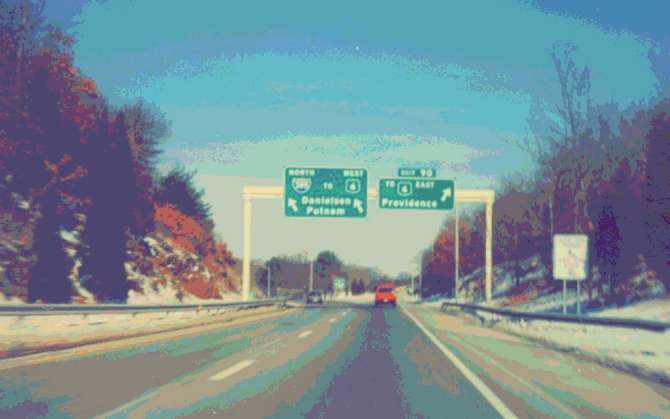

Редакция «Гзома» трепещет и разбирается в грамматических и синтаксических ингредиентах ужаса.

Самая страшная фраза в жанре хоррора, какую я когда-либо встречал: ‘My brother was actually eaten by wolves one winter on the Connecticut Turnpike’. В популярном русском переводе: «В действительности моего брата как-то зимой съели волки на Коннектикутской платной автостраде». Её безотчётно, теряя рассудок, произносит Майк Энслин, главный герой рассказа ‘1408’ Стивена Кинга. Хотя читатель уже знает, что брат Майка скончался от рака лёгких.

Куда жутче, чем у Артура Конан Дойля: ‘…it was Dawson’s wife, all cut into ribbons, and half eaten by jackals and native dogs’. Или, как передала по-русски Марина Литвинова, «…это была жена Доусона, разрезанная на куски и брошенная на съедение шакалам». Жестоко, тем не менее доступно обыденному разумению.

А тут — сгусток холодной тьмы. Превознося «магию слова», обычно подразумевают что-то подобное. Божью искру, не божью ли, не искру ли — кто что. Не рвусь, да и не сумею разобрать волшебную шкатулку по винтикам. Метафора, однако, верна в том отношении, что за нерасторжимым иррациональным единством стоит психологическая и языковая механика. В ней же кое-что понять нам по силам.

Мои ремарки в первую очередь относятся к английскому оригиналу; перевод Виктора Вебера — достойный, но упомянутая фраза в нём совсем не пароксизм вязкого безумия.

### Ингредиенты страха

#### I

На грани паники, рассуждая вдобавок о мучающей его до сих пор смерти брата, Майк формулирует причину трагедии и её обстановку в деталях, едва ли не чопорно. Эта фраза — межевой столб на границе между внечеловеческим, внерациональным миром и логикой, способностью к рефлексии. Сознание вербализует, и вербализует с подчёркнутой педантичностью, словно по каноническому [The Elements of Style](https://en.wikipedia.org/wiki/The_Elements_of_Style), нечто абсурдное, несусветное, и это нечто благодаря внутренне непротиворечивым подробностям норовит обернуться реальностью.

#### II

С каждым словом заостряется контраст между **смыслом и синтаксисом с лексикой.** Actually настраивает нас на повествовательную речь, деловую или нейтральную. One winter в дополнение к тому придаёт предложению налёт сказа, с его размытостью, вариативностью хронологии («однажды, в студёную зимнюю пору», «долго ли, коротко ли»). Тогда как герой прекрасно помнит, когда именно скончался его брат, и каждый день совершает маленький ритуал в его память.

#### III

Неслучайная инверсия. В норме обстоятельство времени стояло бы после обстоятельства места: he died <…> on the Connecticut Turnpike one winter. Оно возможно и в начале предложения, но не здесь: «Однажды зимой мой брат умер…» — совсем о другом.

Живая речь в американском английском гибче гибкого, и отклонения от регулярного порядка допустимы, но у Кинга очерёдность второстепенных членов важна: волки — зимой — в Коннектикуте — на платной автостраде. Провозглашается нереальное: «Брат не умер от многолетнего курения, его съели волки». Делается шаг в сторону, казалось бы, невероятного допущения: «Был съеден волками зимой»; ну да, волки в стужу голодны, а человек беспомощнее обычного. «Зимой, на Коннектикутской платной автостраде» путает карты: с одной стороны, уточнения усыпляют бдительность читателя, с другой — вызывают ещё больше вопросов. Неужели никто не остановился? На платных трассах, конечно, меньше машин, а Коннектикут — малонаселённый штат на севере США, но всё же?.. Неопределённость нарастает, подтекст давит.

#### IV

Первая часть предложения выдержана в чётком стихотворном размере: это амфибрахий, трёхсложная стопа с ударением на втором слоге.

My brother was actually eaten by wolves  
One winter…

С того же размера начинаются лимерики — шутливые пятистишия-«нонсенсы»: ‘There was an Old Man of Calcutta…’ У Кинга детская форма и недетское содержание рождают строчку более зловещую, чем памятное «Раз, два, Фредди заберёт тебя». А дальше размер ломается — и готов сломаться главный герой.

#### V

Возможно, льда за шиворот добавляет неявная отсылка к библии, которую — и слог которой — в англосаксонском мире знают гораздо лучше, чем в России: ‘He was eaten by worms and died’ — «…и он [Ирод], быв изъеден червями, умер» (Деян. 12:23).

#### VI

Читателя-американца реплика берёт за живое ещё и потому, что в ней квинтэссенция одного из главных страхов континента — being abandoned. Необъятные пространства, непредсказуемость стихий — и великолепная инфраструктура для их преодоления, только в заранее заданных пределах. Шаг в сторону, даже непонятно в какую, и пеняй на себя.

Сверх того, между подлинной, известной нам из начала рассказа причиной смерти брата Майка и смертью от волчьих зубов вычерчивается параллель: борьба с опухолью как попытка в одиночку справиться с безличными силами природы и с внутренними демонами, которые не поддаются дрессировке. Пик хайдеггеровской «заброшенности в бытие» — die Geworfenhein. Агорафобия, перетекающая в экзистенциальный ужас и обратно, как в сообщающихся сосудах. Бррр.

> От того, что сквозь абсурд брезжит смысл, ещё тягостней и непонятней.

#### VII

Наконец, снова пугающая недоговоренность. Eaten by — это значит «он замёрз насмерть, труп его был обглодан до костей» или «его сожрали заживо»? Остаётся лишь догадываться (возможно и первое, см. в самом начале пример из Конан Дойля), но почти наверняка — второе. То же в русском: «Его съели волки» по умолчанию предполагает не «Увидев волков, он мгновенно скончался от удара, тут-то они его плотью и попировали».

Почему я говорю о самой страшной фразе в жанре хоррора, а не о самой страшной фразе в художественной литературе? Потому что тогда придётся перейти от утилитарного, как ни крути, саспенса к бóльшим масштабам страшного; вспомнится и чеховское «Заперто. Уехали… Про меня забыли…», и финал «Процесса» Кафки:

> «Но уже на его горло легли руки первого господина, а второй вонзил ему нож глубоко в сердце и повернул его дважды. Потухшими глазами К. видел, как оба господина у самого его лица, прильнув щекой к щеке, наблюдали за развязкой.
> 
> — Как собака, — сказал он так, как будто этому позору суждено было пережить его».

Но это уже совсем другой страх. И не всегда он предполагает разрядку.