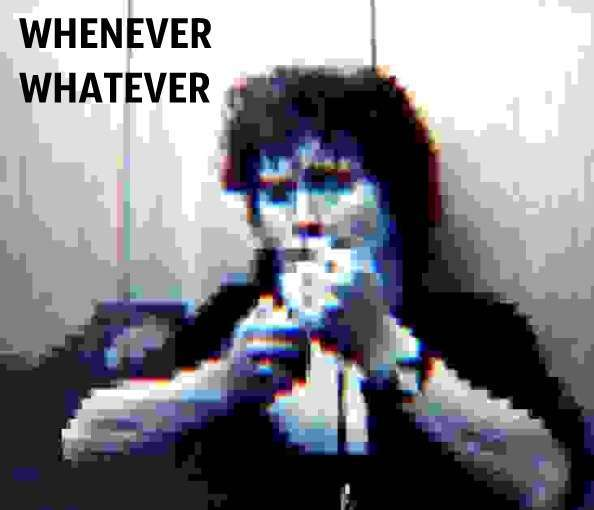

«Нам с тобой // Встанет Лепс глухой стеной», или какая ошибка, допущенная Виктором Цоем, прижилась в речи многих из нас.

Помните у Цоя: «И где бы ты не́ был, что б ты не делал, // Между землёй и небом война»? Он ошибался. Не по сути: война войной, а промашка тут с манёврами — формой выражения. Вместо отрицательной частицы должна быть усилительная: «И где бы ты ни́ был…» — и вот почему.

Читаем в «Русской грамматике» (1980):

> «§ 3043. В предложениях, выражающих уступительные отношения, соотносятся две ситуации, из которых одна, представленная в придаточной части, не является достаточным основанием для того, чтобы отменить собою другую, представленную в главной части. <…> Обобщённо-уступительные отношения принадлежат конструкциям, придаточная часть которых, сближающаяся с вводной (модально-оценочной) конструкцией, оформлена местоименным словом в сочетании с частицами „бы“ и „ни“: что бы ни (чего бы ни, чем бы ни и т. п.), кто бы ни, какой бы ни, каков бы ни, сколько бы ни, как бы ни, где бы ни, куда бы ни. В таких построениях акцентируется неопровержимость утверждаемого в главной части, — несмотря на высокую степень убедительности контраргумента или вопреки силе препятствующих обстоятельств».

Уступительные придаточные часто путают с предложениями вида «Что [кто-то или что-то] только не [глагол]», «Куда [кто-то или что-то] только не [глагол]» и так далее — простыми восклицательными. Они могут входить в состав сложносочинённых предложений, допустим: «Куда только я не ходил, а толку — только циферки в фитнес-трекере прибавились». Смысл эти две категории предложений передают совершенно разный.

Сравните:

_Где бы ты ни был, я тебя найду = Я найду тебя в любом месте_  
_Где ты только не был! ≈ Был ты много где_

В первом случае частица усиливает утвердительное высказывание: «где бы ни» ≈ «где угодно». Во втором употребляется отрицательная частица «не»: «Где ты только не был!» ≈ «Трудно найти место, где ты не побывал».

Под «Где бы ты не́ был» Цой определённо имел в виду «Вне зависимости от того, где ты находишься или будешь находиться». Значит — «ни»; беда в том, что из-за стихотворного размера и особенностей исполнения «е́» слышится избыточно ярко, на нём во-о-от такенный акцент. Да, будь в тексте «ни», исчезла бы рифма с «небом». И текст был бы другим.

А вот в песне «Александра», известной по фильму «Москва слезам не верит», всё верно: «Что бы ни́ было вначале, // Утолит он все печали» (текст Д. Сухарева и Ю. Визбора).

Предвижу возражения: «Но это же приём, как минимум художественная вольность». И отвечаю: нет. Приём и художественная вольность — это, например, смещение ударения с глагола на отрицательную частицу в «Итальянце» Михаила Светлова:

Никогда ты здесь не́ жил и не был!..  
Но разбросано в снежных полях  
Итальянское синее небо,  
Застеклённое в мёртвых глазах...  

Это абсолютно закономерное явление для русской речи, сравните «взять зá бороду» и «взять за бо́роду». Правда, в норме глаголы «был» и «жил» по-разному ведут себя в сочетании с отрицательными частицами: «Я здесь не́ был и не жи́л». Но грамматически, фонетически это допустимый сдвиг, который считывается носителем языка и заставляет его взглянуть на всю фразу с нового ракурса. Между «не был» и «не жил», таким образом, возникает параллелизм, эти два предикатива начинаются мыслиться как равновесные, сопоставимые, вдобавок отрицание ощутимо усиливается.

А Цой просто ошибся. Такое бывает, и «мы любим его не за это».