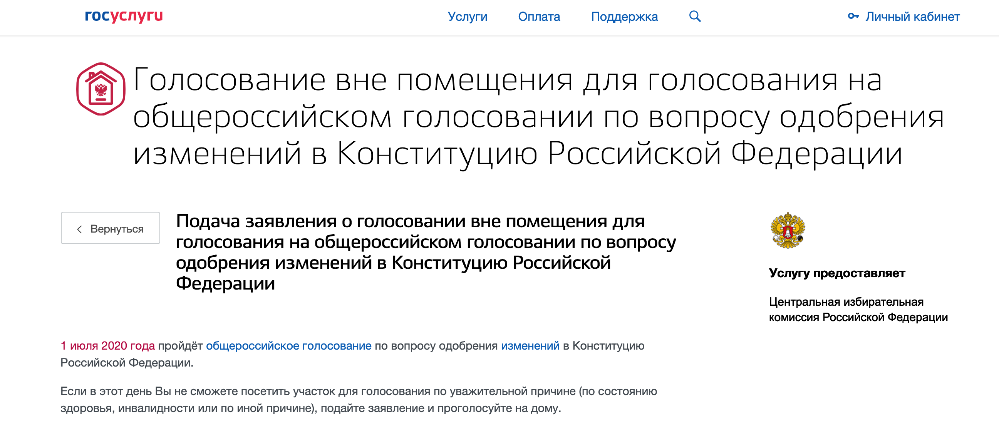
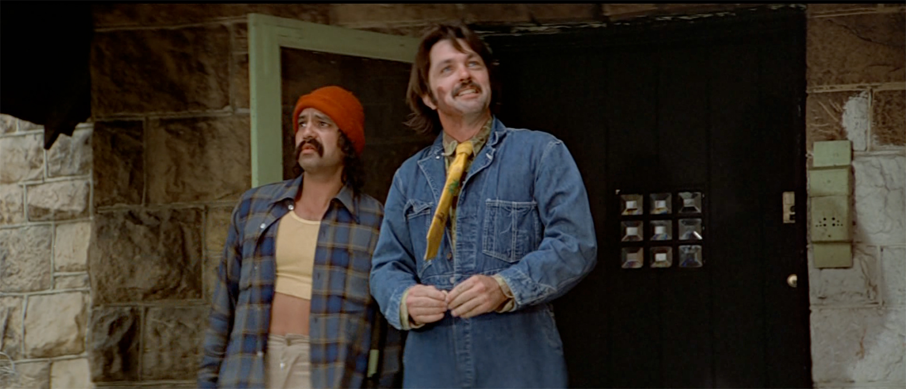

Разбираемся с тем, как название одной из инструкций по дистанционному голосованию на сайте «Госуслуг» отражает парадоксы административного канцелярита.

…И возжелал я подать свой голос, пребывая в родных стенах. И посетил я обитель «Госуслуг». И узрел я, как на вожделенной странице пылали огненные буквы… — ладно, зияли, точно провалы в подсознание политтехнолога, аспидно-чёрные литеры, начертанные шрифтом «Экибастуз»: «Голосование вне помещения для голосования на общероссийском голосовании по вопросу одобрения изменений в Конституцию Российской Федерации». И уразумел, что пророчество это нуждается в моём истолковании. Иначе я сам тронусь.

Нет, это, вопреки первому впечатлению, не рекурсия в духе дюрренматтовского «наблюдения за наблюдающими за наблюдателями». И не околесица. Писавший, очевидно, имел в виду что-то а-ля: «Как участвовать в общероссийском голосовании по поправкам к Конституции Российской Федерации без посещения избирательного участка». Или того проще: «Как проголосовать по изменениям в Конституции РФ через интернет».

Сильнее всего по зрелом размышлении изумляет сочетание речевой хитрости и неуклюжести, воплощённое в процитированном предложении с какой-то даже и неправдоподобной яркостью. Казалось бы, лютейший, тем не менее тривиальный канцелярит, каким строчат простыни текста влёт и безотчётно. В то же время этот неудобоваримый текстовый полуфабрикат содержит несколько ингредиентов, благодаря которым читателю легче проглотить, возможно, малоприятные ему смыслы.

Тот факт, что вся конструкция представляет собой длиннющий «номинативный шашлык» (десять последовательно связанных между собой существительных!), где слабая предикация зашита исключительно в отглагольные существительные, лежит на поверхности. Любопытнее разобрать её по частям и посмотреть, с одной стороны, какие риторические приёмы и кунштюки в ней скрыты, с другой — в чём её грамматическая и нарративная ущербность.

Перво-наперво проблематично, по крайней мере без разбега, синтаксическое членение предложения. Расстановка акцентов в нём тоже амбивалентна. Впору усомниться, рассказывают нам (а) о возможностях «голосования вне [любого] помещения», чтобы мы проголосовали за или против поправок, находясь на свежем воздухе (допустим, в качестве меры противодействия пандемии!), или (б) о возможностях «голосования вне помещения [предназначенного] для голосования». По всей вероятности, всё-таки второе: первое было бы слишком по-хипповски по меркам консервативной российской власти.

Слово «голосование» в заголовке страницы встречается трижды: «Голосование₁ вне помещения для голосования₂ на общероссийском голосовании₃ по вопросу одобрения изменений в Конституцию Российской Федерации». Первое и второе вхождения существительного во фразе, несмотря на внешнюю идентичность всех трёх, качественно отличаются от третьего.

> Для тех, кто так же охоч до бесполезных знаний, как создатели «Гзома»: «голосовать» — акциональный глагол, точнее, глагол социальных интерсубъектных отношений (по семантико-грамматической классификации глаголов Г. А. Золотовой). Согласно классификации М. Гиро-Вебер, «голосовать» — так называемый динамично-постепенный глагол, какие призваны «обозначать ситуации, которые продвигаются к своему внутреннему пределу, и достижение предела исчерпывает и автоматически завершает действие». Те же свойства остаточно сохраняются у девербатива «голосование». Сделаем оговорку: темпоральная (временна́я) семантика базово не присуща существительным, однако при практическом маркировании у существительных отглагольных носители языка могут быть способны различать такие характеристики. 

В первом и втором случае («голосование вне помещений для голосования») мы имеем честь оперировать отвлечённым отглагольным существительным, или именем действия, с преобладанием — запомним! — **процессуального** компонента. Кроме того, в зависимости от контекста оно соотносится как с индивидуальным, так и коллективным агенсом — активно действующим лицом, инициатором ситуации (здесь: тем, кто идёт голосовать). То есть выражение вида «осуществлять голосование» может быть применено как к одному человеку, так и к группе какой угодно величины. Иначе говоря, это сам акт голосования, процесс осуществления выбора и его закрепления: берёте бюллетень → кладёте его на твёрдую поверхность → ставите галочку, отмечая свой выбор → берёте бюллетень → подходите с ним к избирательной урне → опускаете его в урну → done. В таком значении слово выступает, к примеру, во фразе: «Результат моего голосования ни на что не влияет, с моей стороны это чистый перформанс».

Если разложить эту лексему, по Анне Вежбицкой, «на семантические примитивы», то есть на простейшие значения, которые, взаимно комбинируясь, образуют совокупность смыслов, передаваемых словом, то получится нечто вроде:
- процесс;
- протяжённое, но предполагающее завершение действие;
- осуществление выбора;
- реализация своей власти, влияния через выбор;
- осуществление выбора по решению какого-либо вопроса;
- осуществление выбора за счёт предпочтения одного из более чем одного вариантов;
- фиксация выбора для дальнейшего учёта;
- фиксация выбора в конвенциальной, принятой инициаторами и участниками процесса форме;
- участие одного в коллективном процессе осуществления выбора;
- участие многих в коллективном процессе осуществления выбора;
- и так далее (на самом деле это промежуточная стадия разложения слова на примитивы, и учтены вовсе не все его семантические составляющие. — Прим. ред.).

Семантический примитив «реализация своей власти, влияния через выбор» вовсе не третьестепенный. По теории речевых актов Джона Остина, то значение «голосовать», от которого образовано «голосование», позволяет отнести его к классу экзерситивов — глаголов, выражающих манифестацию власти. В рассматриваемом случае подразумевается власть к [гипотетическому] влиянию на гражданское общество и функционирование государственных механизмов.

В третьем случае — «на общероссийском голосовании» — перед нами также отглагольное существительное, оно же деварбатив, вот только уже с преобладанием **событийного** компонента (event nominal) и агенсом скорее коллективным, чем индивидуальным. Денотат, то есть соотносимое с лексемой явление реального мира, здесь — голосование, понимаемое как более протяжённое во времени явление, того же порядка, что и «празднование», «наводнение» и т. д. Семантика событийности подкрепляется и предлогом «на» — ср. «на гуляниях», «на присуждении [премии]», вдобавок несёт в себе топологический оттенок: «Я буду на голосовании» отчасти сопоставимо с каким-нибудь «Я буду на баррикадах» и включает в себя сему «буду находиться в определённом месте или одном из совокупности мест» наряду с опорной «буду голосовать [в том месте]».

Когда «голосование» употребляется в событийном значении, в число семантических примитивов, на которые декомпозируется слово, не входит пункт «участие одного в коллективном процессе осуществления выбора». Кроме того, у «голосования как события» в теории может быть та же протяжённость, что и у «голосования как процесса» (вообразим, все в одну минуту пришли на избирательный участок, сделали выбор и разошлись), однако на практике, скорее всего, она будет ощутимо больше и будет включать в себя дополнительные фазы: участники УИК подготавливают необходимое для голосования → открываются избирательные участки → люди начинают приходить на участки, и каждый проходит ранее описанный процесс, а именно… → берёт бюллетень → кладёт его на твёрдую поверхность → ставит галочку, отмечая свой выбор → берёт бюллетень → подходит с ним к избирательной урне → опускает его в урну → в назначенный срок избирательные участки закрываются → *начинается подсчёт голосов.

По сути дела, в препарируемой фразе мы обнаруживаем труднозаметную **полисемию**: «голосование» в ней варьируется по семантическому наполнению, хотя основа сохраняется. Разница примерно как между английским герундием voting и существительным voting: ‘I think first you should try voting’ против ‘The voting was restricted to the candidates obtaining the greatest number of votes’ — «Думаю, сперва тебе стоит прибегнуть к голосованию» против «Голосование ограничивается кандидатами, набравшими наибольшее число голосов» соответственно.

Едва ли автор отдавал себе отчёт в том, что «голосование» у него принимает разные значения, однако эти значения он явно хотел выразить, только не сообразил как, отсюда и троекратный повтор.

Дальше — обстоятельство места «вне помещения для голосования». Подразумевалось, по-видимому, «не на избирательных участках», и дальнейший текст на странице «Госуслуг» тому подтверждение: «Если в этот день Вы не сможете посетить участок для голосования по уважительной причине…» Здесь мы имеем дело с промахом при выборе синонимического словосочетания вместо оборота «избирательный участок». Тот предполагает более высокую степень абстракции, и его топологический статус не замкнут на конкретные денотаты («здание школы», «передвижную кабинку» и т. д.), в том числе не ограничивается ни строениями, ни тем более помещениями. Это приблизительно как ляпнуть вместо «Го в доту на европейском серваке» что-то вроде «Го в доту на европейском блейд-сервере»; блейд-сервер — это форм-фактор, вариант исполнения сервера, и не факт, что игра будет происходить именно на сервере такого типа, да, кстати, это и не важно.

> И точно, речь идёт не только о помещениях: «„Есть рекомендация организовать участки на открытом воздухе. Возможно, это будут какие-то шатры. В Ханты-Мансийске, например, решили, что все избирательные участки будут на открытом воздухе“, — сообщил Znak.com председатель избиркома ХМАО Денис Корнеев».

Следующая спорная синтагма — «по вопросу одобрения изменений». Такая формулировка содержит хитрую импликацию: мало того что само существительное «одобрение» обладает мелиоративной, положительной коннотацией, сдвигается сам ракурс высказывания. Там, где при непредвзятости пишущего должен был бы развернуться нейтральный **диктум** (суждение о положении дел), тихохонько всплывает модус — **оценка** положения дел со стороны пишущего. «Одобрение поправок», несмотря на связанный с ним «вопрос», волей-неволей сцепляется в отдельный месседж.

Примечательно, что проанализированное ранее дополнение с оценочной импликацией («…одобрения изменений») примыкает к существительному, которое образовано от «голосовать» — **глагола диктума**, описывающего внешнюю сторону явления безотносительно восприятия наблюдателя или действующего лица, без положительной или негативной окраски; см. работу «Субъективность — модальность (материалы активной грамматики)» Т. И. Красновой. Таким образом словно бы становится бесшовным переход от нейтральной повестки к сентенциональной, ангажированной — на очень малой дистанции.

Теперь посмотрим, что неладно с пассажем «[для] одобрения изменений в Конституцию Российской Федерации». Прежде всего, в нём нарушено грамматическое управление: без глагола дополнение «в Конституцию Российской Федерации» оказывается зависимым от существительного «изменения», а оно при наличии у дополнения предлога «в» сочетается только с предложным падежом — нормативно было бы «…изменений в Конституции Российской Федерации». По-видимому, тот, кто составил фразу, подразумевал нечто наподобие «для одобрения внесения изменений в Конституцию Российской Федерации»: в таком случае именная группа «в Конституцию Российской Федерации» зависела бы от «внесения», которое, и действительно, допускает управление с предложным падежом. Однако, возможно, у пишущего сработал граммар-предохранитель, который, казалось, давным-давно перегорел, и настолько длинную цепочку родительных падежей он счёл перебором.

В целом же измельчённый нами ради съедобности «номинативный шашлык» страшен не тем, что языковые эвристики под нашей черепной коробкой его не «разжуют»; пусть жёстко, пусть с жилами, но, если приложить усилия, переварится. Хотя монструозная цепочка существительных для восприятия и правда тяжела. По-настоящему печально, что действие во фразе практически отсутствует. Сверх того, у «тени действия», которая в ней различима, нет принадлежности. Ясно лишь, что «что-то где-то будет совершаться». Где-то за что-то будет голосоваться. И даже если разобраться в изложенном, не факт, что за ним не откроется пустота — лексическая и концептуальная. Зато факт, что разобраться — значит упростить выбор себе.