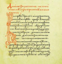
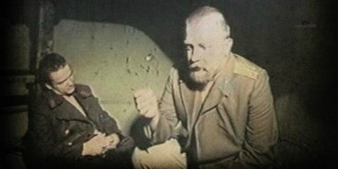
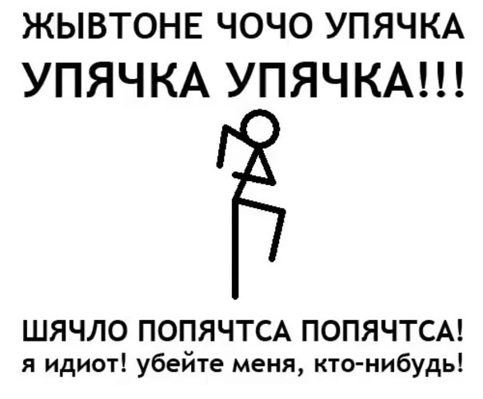

Со школы мы затвердили накрепко: обращение выделяется запятыми. Но бывает, что совы не то, чем они кажутся, и бывают «обращения», которые обращениями не являются.

По аналогии с ложными друзьями переводчика — вроде английского politician, которое чаще всего переводится не как «политикан», а как «политик», — в языке существуют синтаксические конструкции, с оформлением которых якобы никак нельзя ошибиться, настолько всё просто. Но от чего, от чего, а от обращений такой каверзы не ждёшь.

Общий случай учителя русского, или, чуть старомодно, словесники, нам растолковывали верно: обращение обособляется. Реже, когда вынесено в начало фразы и произносится с подъёмом, отъединяется от последующего пассажа восклицательным знаком. Тут свои тонкости: например, случается, что между частями обращения помещаются другие члены предложения. Но в целом — так.

А если под обращение маскируется что-то другое (интрига!), подчиняющееся иным правилам пунктуации? Если не вникать в нюансы, легче всего прибегнуть к принципу, который шутливо сформулировал американский поэт Джеймс Уиткомб Райли: «Когда я вижу птицу, которая ходит, как утка, плавает, как утка, и крякает, как утка, я зову эту птицу уткой». Только идентификация по внешним признакам работает не всегда. Зато всегда работают здравый смысл и знание выразительных средств языка.

### Обращение строптиво

Чтобы понять, является ли часть предложения обращением, хорошо бы понять, что оно вообще за птица. Если совсем коротко, это коммуникативная единица, которая может входить или не входить в состав предложения (обычно не входит), служит для обозначения лица или предмета, которому адресовано высказывание, и выполняет либо первую из упомянутых функций, либо обе:
- призыв, привлечение внимания, выделение из окружающего мира;
- эмоциональная оценка лица, предмета, явления или ситуации.

К XIII веку в письменном русском языке обращение использовалось вовсю, подчас стилистически тонко. В чрезвычайно коротком [«Молении Даниила Заточника»](http://www.drevne.ru/lib/zatoch_s.htm), адресатом которого был переяславско-суздальский князь Ярослав Всеволодович, чередуются следующие обращения (в звательной форме): «господине», «княже», «княже господине», «княже мой, господине», «княже господине», «княже мой», «господине мой». Пятьдесят оттенков древнерусского этикета!

С призывом и привлечением внимания ясно: «Знаешь что, Вадим, завязывал бы ты со своим стимпанком, запарил уже». Впрочем, не всегда обращение подразумевает хотя бы потенциально возможную коммуникацию: «О поле, поле, кто тебя // Усеял мёртвыми костями?» (А. С. Пушкин, «Руслан и Людмила») — пример того, как нечто выделяется, «выхватывается» из окружающего мира. Не обязательно обращение апеллирует к реально существующим персонам или предметам. Оно может выражать направленность речи, например, к абстракции: «…Твой посох принять, о Сестра Нищета» (Н. С. Гумилёв, «Крест»).

Часто обращение содержит в себе эмоциональную оценку, выражает отношение говорящего к адресату: «Сюда, матушка-барышня, пожалуйте, — сказал певучий женский голос, — тут у нас чисто, красавица» (А. П. Чехов, «На пути»).

Не бином Ньютона? А как вам фраза: «Провались (,) унтер-офицерша — мне не до неё!» (Н. В. Гоголь)? В главном, хоть и не исчерпывающем пособии по правилам русского языка читаем:

> Не являются обращениями и не выделяются запятыми названия лиц и предметов, находящиеся при форме повелительного наклонения глагола, если она употреблена в значении пожелания (пусть…): «Приходи к нему лечиться **и корова и волчица**» (К. Чуковский); «**Всяк сверчок** знай свой шесток» (пословица); ср. также: «**Кто постарше** садитесь».
> 
> _(Д. Э. Розенталь, «Справочнике по правописанию и литературной правке»)_

Хотя глаголу в повелительном наклонении обращение может сопутствовать: «Врите, Аврелий, да не завирайтесь», «Иди-ка сюда, дурашка». Так что одной лишь формой сказуемого руководствоваться в наших умозаключениях нельзя. Надо вникать в суть послания. И понимать, с чем мы имеем дело — с «чистым императивом» или с желательным наклонением, по-научному оптативом, который реализован через повелительное наклонение.

> Форма желательного наклонения организуется постановкой глагола в форме, совпадающей с формой повелительного наклонения. Значение желательности при этом сочетается со значением отвлечённого побуждения, собственно волеизъявления, не адресованного к реальному исполнителю: «Случись что-нибудь! — мысленно молила я то обстоятельство, которое ещё не имело названия в моём воображении, но которое должно было расставить всё по своим полкам. — Случись что-нибудь!» (Д. Рубина). Эта форма, частая в устойчивых речениях, имеющих характер заклинания, образуется лишь с отдельными глаголами (см. примеры ниже). Она характерна для разговорной речи, просторечия, текстов с фольклорным колоритом, ярко экспрессивно и стилистически окрашена: «Провались эти бесконечные дела!», «Сгинь эти проклятые деньги!»
> 
> _(«Русская грамматика — 80»)_

Как распознать эту форму? Да с помощью не всуе помянутого ранее здравого смысла. Задуматься, есть ли в предложении призыв к конкретному лицу или явлению. Увещевает ли Корней Чуковский корову и волчицу, побуждает ли их, вот лично их посетить чудо-эскулапа? Нет. Он обозначает возможность нанести визит и подчёркивает, что к помощи стоит и желательно прибегать представителям названных биологических видов. «Приходи к нему лечиться и корова и волчица» ≈ «Пусть приходят к нему лечиться и корова и волчица». Или, будь «Айболит» высокопарным литургическим текстом: «Да придут к нему и корова и волчица».

То же у Пушкина в поэме «Анджело»: «Брат лучше раз умри, чем гибнуть мне навечно» ≈ «Лучше пусть [мой] брат умрёт один раз, чем гибнуть мне навечно» (сестра произносит эту реплику в отсутствие брата и вовсе не обращаясь к нему).

Думаете, мы углубились дальше некуда? Есть куда. Переходим в режим Nightmare. Вот вам цитата: «Да провались он к дьяволу (,) этот приусадебный участок!» (Фёдор Абрамов, «Две зимы и три лета»). Казалось бы, всё как описано в «Русской грамматике»: ирреальная модальность (описывает действие, которое не может произойти), «провались» тождественно «пусть бы провалился», «вот бы провалился». Но в предложении есть соотносительное слово — «он». А словосочетание «этот приусадебный участок» поясняет его, поэтому обособляется. Ставим запятую. Сравните с обычным предложением, без обращения: «Он, этот садовый участок, пусть провалится».

Бывает и что автор предпочитает оформлять предложение такого типа, как если бы в нём было подлинное обращение, и тем самым это самое обращение свой авторской волей создаёт: «И поскорей умри, умри, // Та ночь Мариенбурга!» (Давид Самойлов). Впрочем, у поэта удвоение глагола, усиливающее посыл, располагает к тому, чтобы за ним следовало обращение.

### Розенталь на максималках

Раз уж мы взялись докопаться до пунктуационной правды, давайте добросовестно утюжить сложные случаи. Вернёмся к приведённой выше цитате из Розенталя, а именно к фрагменту: «…ср. также: Кто постарше садитесь». Дитмар Эльяшевич, спору нет, был великий учёный и методист, но не все речевые ситуации сумел описать с высшей степенью внятности. Да и невозможно это было: иногда «сталкиваются» два правила, диктующие противоположное употребление знаков препинания, и мнения грамматистов о предпочтительном выборе разнятся.

Вот что значит «сравни также»? Что предложение «Кто постарше (,) садитесь» подпадает под действие того же правила, что и «Приходи к нему лечиться и корова и волчица»? Формулировка если не тёмная, то скользкая. Рассуждая логически, да, подпадает. Но, во-первых, не является ли часть «кто постарше» придаточным предложением и не надо ли, следовательно, отделить её запятой? А во-вторых, фразу легко прочесть и как чисто побудительную, а не как пожелание «Пусть старшие [из вас] садятся». В печати — разнобой:

> Это вы бываете довольны, когда у вас берут жен кто повыше вас, а не мужики.
> 
> _(И. Ф. Анненский, «Книга отражений», 1906)_

> Кто поумнее, много набрали: выбирали время, когда идёт куда с приезжими барынями.
> 
> _(Н. А. Морозов. «Повести моей жизни/ Во имя братства», 1912)_

> Кто постарше, подошёл ближе, малыши стояли в отдалении; засунув пальцы в рот и тараща глаза, они смотрели на пионеров, хотя видели их уже не в первый раз.
> 
> _(Анатолий Рыбаков, «Бронзовая птица», 1955–1956)_

> А кто постарше, вспоминали какого-то Байрама, которого Руслан не застал…
> 
> _(Георгий Владимов, «Верный Руслан» (1963-1965)_

> Живыми доехали кто покрепче.
> 
> _(Ирина Ратушинская, «Одесситы», 1998)_

В заслуживающем полного доверия пособии Нины Сергеевны Валгиной находим похожий случай с обращением:

> В разговорной речи в качестве обращений могут употребляться неуправляемые предложно-падежные формы. Такие формы контекстно или ситуативно обусловлены. Они называют адресата речи по единственному, ситуативно выявленному признаку. Например: «С высшим образованием, шаг вперёд!»
> 
> _(Н. С. Валгина, «Синтаксис современного русского языка»)_

Возможно, Дитмар Эльяшевич подразумевал, что «кто постарше» следует считать цельным по смыслу выражением — по аналогии со «спасайся кто может», — а значит, и не обособлять его. А вот считать ли цельным по смыслу «бегите (,) кому уж совсем невмоготу стало»? На мой взгляд, всё же нет. Оно тянет на полновесное придаточное.

Единственно верного, твёрдого ответа нет. Однако доказательств в пользу того, что запятую во фразе «Кто постарше (,) садитесь» ставить нужно, больше.

### Устойчив? Ходи без запятой

Другой вид ложного обращения — устойчивые обороты и междометные выражения. Чаще всего в них использовано повелительное наклонение, которое «устало» быть повелительным, у которого «так сложилось исторически». Без шуток! Изначально самые старые из таких оборотов действительно содержали призыв или мольбу и включали в себя обращение. А дальше…

> На более позднем этапе, с развитием мышления и языкового представления реальность пожеланий-заклинаний постепенно приобретала метафорический смысл, и данные формулы преобразовались в идиомы. Человек стал употреблять формулы пожеланий для выражения собственного эмоционального отношения к той или иной ситуации, либо действующему лицу. Тем самым наметился новый этап развития данного языкового явления, когда в ряде случаев пожелания-заклинания уже утрачивают свой метафорический смысл и уподобляются междометиям.
> 
> _(О. С. Косенкова, автореферат диссертации «Фразеологические средства выражения волеизъявления в современном русском языке», 2004)_

В обиходной речи век за веком растворялось изначальное сакральное наполнение оборота, и он превратился в монолитную, нерасторжимую формулу: «господи помилуй», «боже упаси», «господи прости», «сохрани его родительское благословение», «огради его родительская молитва». Сюда же относятся лишённые явно религиозного подтекста, но образованные по той же модели «разрази меня гром», «забодай меня комар», «держите меня семеро».

В таких конструкциях одна из двух первичных функций обращения — апеллятивная — истончается, и остаётся лишь другая — эмоционально-оценочная, с реакцией на ситуацию в целом и без обращения к персоне или объекту.

Если же исходное наполнение сохраняется, то есть в форме повелительного наклонения выражена просьба, мольба, то мы имеем дело с обращением, которое выделяем на письме запятыми: «„Господи Иисусе Христе, сыне Божий, помилуй мя грешного, Господи, помилуй мя грешного“, ― не переставая молился он не только внутренне, но и невольно наружно шевеля губами» (Л. Н. Толстой, «Отец Сергий»).

Конечно, не следует судить лишь по внешней форме оборота: «покарай меня бог» — это междометное выражение, а вот «покарай меня, богиня» может быть просьбой в ходе BDSM-сессии.

Не каждая конструкция поддаётся однозначному толкованию. Те, кто постарше, помнят сайт [«Упячка»](https://upyachka.io/) и одну из его catch phrases: «Я идиот! Убейте меня кто-нибудь». В оригинале — с запятой после «меня». На пожелание это не похоже, скорее самый настоящий императив с обращением, но конкретного адресата нет (при его наличии было бы что-то вроде «Убейте меня, поклонники Эминема»), а местоимение тесно примыкает к глаголу и по отношению к нему не несёт дополнительной нагрузки, кроме усиления экспрессии, так что отсутствие запятой становится допустимым. Сравним с классикой:

> **Голосъ Сердецкаго:** Помогите кто-нибудь… скорѣе, бѣгите за докторомъ!.. Митя!
> 
> _(А. В. Амфитеатров, «Отравленная совесть. Драма в 4-х действиях», 1891–1896)_

Правда, если мы перенесём акцент на неопределённое местоимение, оно окажется способным взять на себя функцию обращения. Тогда, впрочем, придётся разбить конструкцию: «Убейте меня! Кто-нибудь!»

А иногда приходится опираться на контекст. Знаменитая фраза «Оставь надежду (,) всяк сюда входящий», которая завершает надпись над вратами ада в «Божественной комедии» Данте, может быть прочтена двояко — и как прямой призыв с обращением, и как пожелание без такового («Оставь надежду и корова и волчица», в общем). Обратимся к оригиналу: ‘Lasciate ogni speranza, voi ch’entrate’. Дословный перевод: «Оставьте всякую надежду, вы, входящие». Намёк понят: это к нам обращаются. Запятой — быть.

Напоследок — ещё один грамматический выкрутас, который путают с обращением. Величать его «именительным [падежом] темы». Например, пушкинское: «Москва! Как много в этом звуке для сердца русского слилось, как много в нём отозвалось». Эта фигура речи, как ясно по её названию, задаёт тему следующего предложения, но оформляется в виде отдельной фразы, и с постановкой запятых здесь проблем, по счастью, не возникает.