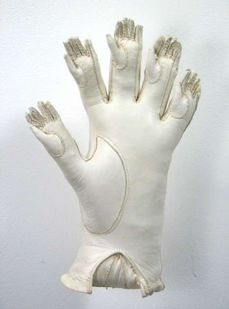
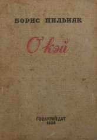

Английское OK по-русски передают, как граммар-тетрис на душу положит. А как надо? Надо ли каким-то одним образом?

— «OK». — «Как-то неодобрительно твоё „окей“ звучит». — «Да не дёргайся. Сказал ок — значит ок». — «Ну о'кей». В текстовой коммуникации легко встретить все приведённые варианты передачи английского OK и ещё столько же. И непонимание, как в диалоге выше, из-за разных написаний тоже возникает. А как правильно-то?

### Отдел боевой лингвистики рекомендует

Первое и главное: слово русским языком освоено и занесено в авторитетные словари. Колеблющимся — спасение. Согласно «Русскому орфографическому словарю» (2012), **в равной мере приемлемы и «окей», и «о’кей»**.

При прочих равных **«о’кей» — вариант более респектабельный, книжный, устоявшийся**. Один из ранних случаев его использования — у Ильфа и Петрова в «Одноэтажной Америке». В хорошо изданных книгах, увидевших свет в СССР и России за последние лет семьдесят, почти исключительно так. В книжных издательствах эту норму блюдут. «Орфографический словарь русского языка» Б. З. Букчиной, И. К. Сазоновой и Л. К. Чельцовой других написаний не признаёт.

Если вы редактор онлайн-издания, бизнес-блога — чего-то менее формального, чем энциклопедия или деловая газета, — советую вам по умолчанию писать «окей» или «о’кей» — либо тот, либо другой вариант. Здесь уж главное — единообразие. Выбрали одну форму — держитесь её.

Однако в авторских колонках, например при передаче живой речи или языка интерфейсов, допустимы, а по мне, даже желательны иные написания: «У нас до сих пор отрицательный ARPU? Ну ок», «Нажмите OK, и будет о’кей». Я вывел для себя эмпирическое правило: **когда сомневаетесь, как передать это слово на письме, произнесите его вслух**. «Четыре тысячи евро за часовую консультацию по ICO? Нам это не ок» — едва ли здесь уместно «о’кей».

> В элементах интерфейса — в большинстве случаев OK, латинскими буквами.

### Теперь — нюансы

По самой распространённой версии, которая в словаре Мерриама — Уэбстера дана как наиболее вероятная, впервые ‘OK’ было употреблено в американской прессе в 1839 году как аббревиатура от oll korrect — нарочито искажённого all correct, или «всё верно». Существует ещё несколько предположений разной степени правдоподобности, о них — в [английской «Википедии»](https://en.wikipedia.org/wiki/OK). Первична именно аббревиатура, с двумя заглавными, без точек. Она же по сей день — каноническая и универсальная.

С тех пор в английском языке возникла целая россыпь орфографических «отражений» исходного ‘OK’. В итоге — ‘It’s OK to spell it okay, and it’s O.K. to spell it Ok’. Да, все четыре приведенных варианты равно допустимы. Различия между ними — на уровне стилистических ажурностей, традиций конкретных жанров, внутренних правил конкретных изданий, личных пристрастий.

«Равно допустимы» не значит «взаимозаменяемы всегда и везде». Форма okay гораздо чаще используется, когда слово употребляется в глагольных формах, таких как okays, okaying, okayed, или предполагает, что они возникнут в тексте дальше. Например: ‘He said okay. Surprisingly, his servile okaying messed up my day’, или «Он сказал да, и от его угодливого даканья, удивительное дело, день у меня пошёл насмарку».

Впрочем, составители гайда The AP Stylebook, выпускаемого агентством Associated Press, настаивают на OK во всех формах — OK’ed, OK’ing и т. д. — и не советуют писать okay. Хотя справочник имеет рекомендательный характер и правила английского языка не регламентирует.

Иные варианты менее распространены, однако также «легальны». Как где принято, как где закрепилось. Например, ‘O.K.’ любят в The New York Times: ‘We’ve done O.K. in the downturn because we started selling online in 2007’.

#### Про функцию «о’кей» в языке
 
«О’кей» многолик. Он бывает и междометием: «Ладно, отправляем на курсы таксидермистов Бахрушеву, а Саня, о’кей, пролетает». Бывает частицей: «Только на меня вину не перекладывай, о’кей?» (≈ «да»). Бывает предикативным наречием, служа сказуемым: «У меня с накладными всё о’кей, а у тебя с головой — нет» (≈ «дело обстоит нормально»). Но точнее всего его трактовать как **слово-предложение**. Это относительно независимое высказывание, не опирающееся на модели простого предложения и употребляемое как изолированно, так и в составе других языковых конструкций. [По определению](https://rusgram.narod.ru/2674-2679.html) «Русской академической грамматики», это «отдельная словоформа или сочетание слов, закрепившее за собой ту или иную коммуникативную функцию и произносимое с соответствующей интонацией». Здесь «о’кей» становится в один ряд с исконно русскими «увы», «брысь!», «ясно».

Ну да нас интересует перво-наперво русский язык. А самых въедливых — ещё и почему второй гласный тут «е», а не «э» и откуда взялся апостроф.

Две нормы — «эшная» и «ешная» — около двух десятилетий соперничали на равных, но после Великой Отечественной войны «о’кей» взял верх и сделался орфографическим стандартом. На обложке книги Бориса Пильняка «О’кэй! Американский роман» (1931) — вариант с «э». В газетах же это название печатали по преимуществу через «е».

Реже, преимущественно в послевоенной, второй половины 1940-х — начала 1950-х, художественной литературе и периодике встречается «о-кей». По-видимому, дефис не прижился потому, что предполагает более сильную сепарацию частей слова, а оснований для неё нет.

При переносе слова на русскую почву возникла потребность и обозначить его «буквенное», от литер O и K, происхождение, и в то же время не противопоставлять части слова, поскольку оно давно перестало быть аббревиатурой и никакого актуального лексического смысла за O и K не стоит. Вместе с тем хоть основное ударение падает на «е», «о» тут слабоударяемое, что также служит доводом в пользу разделительного знака.

Использовать апостроф стало компромиссным решением. Тем более что начальное «о» в фамилиях ирландского происхождения, так называемую фамильную приставку, уже было принято передавать так: О’Рейли, О’Брайан. Собственно, как в оригинале.

### Как писать-то?

- **Безукоризненно и неподсудно:** о’кей
- **Возможно:** окей
- **Нормально в неформальной речи, в интернет-переписке:** ок
- **Плохо:** ОК русскими буквами _(в русском языке это не аббревиатура)_, о-кей _(давно - отмерший по естественным причинам вариант написания)_
- **Годится для стримов, твитчей, юмористических пабликов и всяческой SMM-активности с мимикрией под - целевую аудиторию:** оки, окай, окэ, окккк, оукей, ▼оKaY●
- **То ли мило, то ли рвотно:** океюшки
- **По-английски:** OK, okay
- **Допустимо, но реже:** Ok
- **Также встречаются:** O.K. и O.k. _(для общения с носителями языка, которые пишут именно так)_