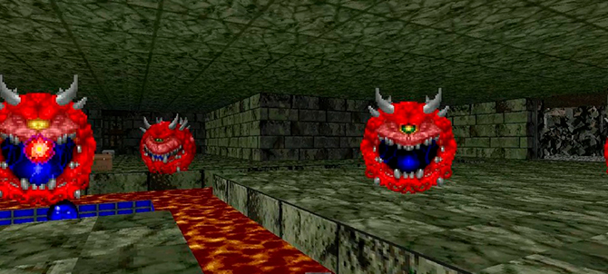

О грамматических и смысловых тонкостях устройства пелевинских неологизмов.

Девятый год подряд на излёте лета из печати выходит очередная книга Виктора Олеговича Пелевина. Безотносительно фабулы, концептуальной составляющей и изощрённости языка каждого отдельно взятого романа или сборника рассказов у главного русскоязычного семиотик-целдвеллера неизменно полный порядок на уровне создания лексики под придуманный им сеттинг. Анализируем, как он это делает, на материале опубликованного в конце августа 2021 года TRANSHUMANISM INC. Внимание: возможны спойлеры!

Словотворчеству писателя посвящено не одно исследование, например «[Окказиональные иноязычные вкрапления в работах В. О. Пелевина](www.vestnik.vsu.ru/pdf/phylolog/2019/02/2019-02-04.pdf)» и «[Окказионализмы в романе Виктора Пелевина „S.N.U.F.F.“](https://elar.urfu.ru/bitstream/10995/66167/1/m_th_k.s.muratshina_2018.pdf)». Однако, при всей их добросовестности, ни в одном не произведён полный и всесторонний анализ моделей (не претендует на всеохватность и настоящая статья), по которым Виктор Олегович создаёт неологизмы, а кроме того, роман TRANSHUMANISM INC. изобилует окказиональными образованиями, как, наверное, ни один из предыдущих.

Дело прежде всего в степени детализации мира, где разворачивается действие романа. Как справедливо 
[заметила](https://meduza.io/feature/2021/08/26/pelevin-etogo-goda-transhumanism-inc) литературный критик Галина Юзефович, «на сей раз <…> Пелевин приложил несколько больше усилий для того, чтобы мир этот описать и эксплицировать». Значительную часть сгенерированной его внутричерепными нейросетями лексики писатель вводит в экспозиции первых двух-трёх новелл.

Среди окказионализмов встречаются как донельзя изощрённо сконструированные, так и красивые в своей структурной простоте. Правда, не все одинаковы хороши. Худшие из результатов пелевинского словотворчества, как и прежде, основаны на лобовых каламбурах. Например, _Ельцинор_, отсылающий к шекспировскому _Эльсинору_, построен путём игрового изменения фонемной структуры узуального слова, имени собственного. К счастью, более чем из шести десятков созданных Виктором Олеговичем для книги слов откровенно неудачные составляют меньшую часть.

Однако львиная доля авторских неологизмов в книге сделана со вкусом, умело и грамматически небезынтересно. Более того, многие из таких новых слов имеют двойное, а то и тройное дно, и некоторые даже позволяют спрогнозировать развитие сюжета.

Разобрать их все — задача неподъёмная без гранта корпорации TRANSHUMANISM INC., поэтому ограничимся полутора десятками. Ещё раз: осторожно, неизбежны спойлеры, хотя редакция «Гзома» старалась свести их к минимуму, и мы настоятельно рекомендуем сперва прочесть книгу, благо она, с нашей точки зрения, того заслуживает.

### Окказионализмы: сад расходящихся нейронных тропок

**«Бум-балалай»** — ресемантизация компонентов ранее существовавшего сложного слова (начальный согласный слова «тумбалалайка», от идиш. טום־באַלאַלײַקע ‘тум-балалайкэ’ заменяется по аналогии со словом «бумбокс»), с усечением основы _балалайк*_ → _балалай_, подразумевающим изменение рода слова. Примечательно, что исходное «тум-балалайкэ» включает в себя звукоподражательный, ономатопический элемент «тум», по-видимому обозначающий удар, что как нельзя лучше подходит к аудиосистеме бродяг скоморохов в мире, который описывает Пелевин: те и выступают под ритмический аккомпанемент, и регулярно побиваемы сами. Здесь и далее в цитатах выделение окказионализмов жирным шрифтом — редакции «Гзома» (произведено в тех случаях, когда те уже не выделены в оригинале курсивом).

> «Скоморохи молча подняли подарки из снега, жилистый усач взвалил на спину **бум-балалай** — и они поплелись со двора к телеге».
> 
> _(В. Пелевин)_

**«Горпина»** — семантическая деривация с конверсией имени собственного в имя нарицательное. Иначе говоря, личное имя превращается в родовое определение, причём производящий антропоним осмысляется при конверсии как коннотативный, говорящий.

> «Киски были послушными. У каждой под мышкой была крохотная татуировка — кириллическое слово **«горпина»** (так называлась модель) и порядковый номер, он же код запуска, который следовало произнести вслух для активации — на английском, арабском или фарси. Дальше они подчинялись простым голосовым приказам — список команд прилагался».
> 
> _(В. Пелевин)_

Горпиной зовут служанку Ивана Никифоровича в гоголевской «Повести о том, как поссорился Иван Иванович с Иваном Никифоровичем», это уменьшительная форма имени Агриппина (судьба раннехристианской святой, мученицы Агриппины Римской также рифмуется с тем, что ждёт горпин в пелевинском тексте). Очевидно, нарицательное «горпина» апеллирует к глупости называемой так модели биомашины и к её сугубо функциональному назначению.

Кроме того, персонаж Горпина, в других переводах Горпына, — крепко сбитая женщина-ведьма, одетая воином-казаком, — фигурирует в романе Генрика Сенкевича «Огнём и мечом». Параллелизм между эпопеей польского писателя и пелевинским текстом через эту лексему также возможен: _горпины_ в TRANSHUMANISM INC. в какой-то момент, по заветам Дэвида Линча, оказываются не тем, чем кажутся.

> «Наконец, он обратился к своему товарищу:  
> — Горпина, далеко ещё?  
> Спутник, которого звали Горпиной и который на самом деле был переодетой по-казацки женщиной огромного роста, взглянул на небо и ответил…»
> 
> _(Генрик Сенкевич, «Огнём и мечом»)_

**«Лазукать»**, возможно, образовано как контаминация основ слов «лазать» и «лазутчик» (оба восходят к праславянскому laziti), а возможно, хотя чуть менее вероятно, позаимствовано Пелевиным из старинной очеркистики или беллетристики. Во втором случае имело место не словообразование, а актуализация архаизма, причём глагол сохранил первичную негативную, неодобрительную коннотацию: «лазукать» (сниж.) — «волочиться [за женщинами]», «ухаживать с дурным намерением».

Так, у русского писателя-мемуариста и учёного XVIII–XIX вв. Андрея Тимофеевича Болотова в пьесе «Честохвал» находим:

> «**Добродушин.** Уже не в девичьей ли он, господин Оронт? Молодец-то ловкой. У него и лучшее это ремесло, чтоб за девушками **лазукать**».
> 
> _(А. Т. Болотов, «Честохвал», 1779)_

Также см.:

> «Это не то, что съ питерскими барыньками **лазукать**, нѣтъ! Эта себѣ цѣну знаеть, горда и неприступна…»
> 
> _(«Историческій вѣстникъ», том 62, 1895)_

**«Позорченко»** — предикатив, образованный по весьма продуктивной окказиональной модели, ставшей набирать популярность в русском языке не позднее чем с 1960–1970-х. А именно: производство предикативных наречий от существительных или наречий с помощью морфов, характерных для антропонимов, в первую очередь фамилий и отчеств. Ср. с предикативами «добридзе» (≈ «одобряю», «прекрасно», по аналогии с грузинскими фамилиями типа Цискаридзе), «нормасевич» (≈ «нормально», по аналогии с белорусскими фамилиями типа Борисевич и др.). Надо заметить, эта модель гораздо более характерна для Владимира Сорокина, особенно раннего: подобные окказионализмы сплошь и рядом встречаются в его «Норме». «Позорченко» мы находим в самом начале книги Пелевина, которое, создавая задел для нарушения читательского ожидания, отчасти выдержано в духе сорокинской прозы.

> «Бесплатно-то бесплатно, но за эту бесплатность пищалка начинала иногда передавать рекламу, причем норовила сделать это именно тогда, когда следовало изо всех сил интим-пищать (говорили, что она засекает рядом второе тело и снимает с рекламодателя оплату как за два включения). Позорченко, конечно».
> 
> _(В. Пелевин)_

> «„Готовченко“, неизм. (или „готовченко готовчук“): <…> 1. О ч.-л. завершённом, пришедшем к концу, сломавшемся и т. п. **Бутылка готовченко готовчук** (допита). **Экзамен готовченко** (сдан).
> 
> _(«Словарь русского арго», сост. В. С. Елистратов, 2002)_

**«ГШ-слово»** — образование композита без соединительной гласной с компрессией первого компонента: _гольденштерн-слово_ → _ГШ-слово_, ср. с «фб-дискуссией» (т. е. «фейсбучной дискуссией»), «бм-релизами» (т. е. «блэк-метал-релизами»). Примечательно, что, будучи сконструированным по аналогии с n-word, которое включает в себя лишь первую букву табуированного существительного, «ГШ-слово» содержит начальные согласные слов, в исторической перспективе сформировавших основу имени шекспировского Гильденстерна: Guilden, от ср.-англ. gilden ‘золотой’ (→ Golden), и Stern, от ср.-англ. sterne ‘звезда’, тогда как в мире, которому _(полуспойлер: имманентен если не сам Гольденштерн, то его имя)_, необходимым и достаточным для функционирования эвфемизма было бы «Г-слово». По-видимому, ведущие мотивы к формированию табу-слова именно таким способом — во-первых, сделать так, чтобы номинация стоящей за ним фигуры считывалась безошибочно, хотя последняя овеяна умолчанием, во-вторых, указать на этимологию фамилии «Гольденштерн», что немаловажно для сюжета. Это максимально точно укладывается в законы существования сеттинга, где разворачивается действие TRANSHUMANISM INC.

По Мильчину, «бм-релиз» — это комбинированное сокращение: инициальная аббревиатура вкупе с графическим сокращением (маркером служит дефис).

> «Споют, выдадут ГШ-слово в разных расфасовках, послушают молча, как их кроют, подберут жратву из грязи — и в лес».
> 
> _(В. Пелевин)_

**«Бро кукуратор»** — двухсловное окказиональное образование, которое строится таким образом, чтобы достигалось его парономазийное _етическое сближение_ловом «прокуратор». Таким образом создаётся любопытный двойственный эффект: с одной стороны, сущность, возглавляющая репрессивно-бенефактивный, карающий и вознаграждающий механизм, является «бро», с другой — грозным управителем-прокуратором (прокуратором «кукух», а точнее, «ку[стодианом и ]куратором»), притом что слово «прокуратор» знакомо большинству русскоязычных читателей по роману «Мастер и Маргарита» (он всплывёт в пелевинском тексте); напрашивается аналогия с оруэлловским ‘Big Brother is watching you’ и идеологемой «Товарищ Сталин — лучший друг советских детей». Титул «бро куратор» порождает так называемый эффект паронимической аттракции, в силу которого происходит ассоциативно-семантическое сближение паронимов, в рассматриваемом случае — «прокуратор» и «бро куратор».

> «С портрета на нее смотрел черноволосый мужчина лет тридцати-сорока, с лицом серьезным и усталым от ночных раздумий. Под портретом была подпись маленькими буквами:
> _бро кукуратор_».
> 
> _(В. Пелевин)_

**«Аккубусы»** — скорее всего, семантическая деривация заимствования из мёртвого языка, а именно латыни. Очевидно, мотивирующей лексемой _лужило лат_ccubus (разновидность демонов-соблазнителей). Это один из редчайших пелевинских окказионализмов, значение которых не разъясняется в TRANSHUMANISM INC. явно. Это, конечно, не гапакс, тем не менее слово встречается в романе всего три раза, в том числе дважды — в одном контексте с «наушниками»; известно только, что, во-первых, аккубусы носят, во-вторых, заряжают наравне или вместе с наушниками. Но вот что примечательно: хотя автор, вне всякого сомнения, сознательно умалчивает о том, что подразумевал под окказионализмом, по его грамматическим и семантическим характеристикам мы восстанавливаем немало. Грамматическая форма — почти наверняка pluralia tantum, то есть множественное неизменяемое, что создаёт параллель между «аккубусами» и «огментами» (очками для восприятия augmented reality, «дополненной реальности»). Вероятнее всего, денотат «аккубусов» в сеттинге произведения — некий технологический или технологически-декоративный гаджет, связанный с сенсорным восприятием.

> «По всему евразийскому Контактону шеренгами висели такие же по сюжету голограммы: юное личико, повязка, красная или белая слеза, голая шейка, кастомная кукуха, навороченные **аккубусы** и дальше — короткий проблеск голой натуры».
>  
> _(В. Пелевин)_

И наконец, семантика. В манускрипте 1477 года из собрания августинской обители в Кракове находим: ‘Hec videns diabolus, qui inimicus spiritualis humano generi est [_lathalecz_] qui specialius laborat in his peccatus sodomiticis… accubus, incubus, succubus, cacodemon, calodemon’. Приблизительный перевод таков: «…Видящий это дьявол, каковой есть духовный супротивник рода человеческого, каковой наипаче усердствует посредством сих [претворителей] грехов содомских… [Имена сим:] аккуб, инкуб, суккуб, какодемон, калодемон». И хотя об «аккубах» знает, пожалуй, не каждый медиевист, ассоциативная связь с более глубоко укоренившимися в массовой культуре «инкубами» и «суккубами» отчётлива. Говорящая параллель применительно к миру, где наисильнейшие плотские соблазны призрачны, зато действуют как никогда интенсивно — на уровне нейроподключения.

Не исключено также, правда, что слово «аккубусы» построено из расчёта на фонетическое сближение с «абакусом» (лат. abacus), то есть «счётами» (тоже, кстати, множественное неизменяемое).

**«Трын-тран»** — усечение с эффектом мотивирующей редупликации, то есть с воспроизводством сущностно значимой лексической основы (ср. с _нцы-шманцы»_десь «трын» рифмуется с «тран», конвенционально произведённым сокращением от «трансгуманизма». При этом «трын» лишь отчасти является сокращением: _тр_ получено усечением от «три», тогда как десемантизированный формант _-ын_ добавлен к основе прежде всего ради образования созвучия с «тран». Интересно и что редуплицируемая, обыгрываемая с помощью созвучия часть идёт после редуплицирующей, тогда как чаще последовательность обратная. На уровне фонетики и семантики «трын-тран» очевидным образом перекликается с «трын-травой» — растущим в труднодоступных местах растением из славянской мифологии, которое дарует тому, кто добудет его, храбрость и способность преодолевать любые опасности. Ирония Пелевина здесь проявляется особенно ярко: «трын-тран», в отличие от «трын-травы», едва ли не общедоступен, и дело лишь в том, чтобы разглядеть ничем и ничем специально не подсвеченное знание о мироустройстве.

> «Маня часто прогуливала лицейские лекции. Но ее интересовало все связанное с папой, поэтому на «Три Ветви Трансгуманизма» (или, как говорили в лицее, _трын-тран_) она ходила почти всегда…»
> 
> _(В. Пелевин)_

**«Небинарий»** получен образованием существительного склонения 7а (по [модели А. А. Зализняка](https://ru.wiktionary.org/wiki/_исловарь:Использование_словаря_Зализняка_el=)) с усечением основы и наращением постфикса _-ий_ от прилагательного «небинарный». Акцентологические и лексические параллели побуждают усмотреть в термине социально-идеологическую или даже сословную принадлежность: ср. с «карбонарий», «терциарий» и т. д., — а не просто гендерное определение персоны, что и явствует из сеттинга романа.

> «Дело было не в любви. Папа мог делать это с любой женщиной, мужчиной или **небинарием**, которого только можно вообразить, а мама была _ не особо
> 
> _(В. Пелевин)_

**«Кустодиан»** — освоение англоязычного заимствования, русифицированного путём транслитерации: термин образован побуквенной передачей _л._страж, хранитель’, [kʌˈstəʊdɪən] — от лат. custōdia с тем же значением. Введение нового термина, заимствованного из английского, при наличии немалого числа аналогов в русском — «страж», «хранитель», «блюститель», «смотритель» и пр., — с одной стороны, знаменует эффект синонимической аттракции: в соответствии с концепцией Стивена Ульманна, объекты, наиболее значимые для носителей языка, получают в языке наиболее развёрнутые, богатые синонимические ряды, в том числе поскольку требуют больше лексических средств для выражения семантико-стилистических нюансов предмета, на который указывают; вспомним, в частности, многообразие номинаций для _Маниту_ в пелевинском романе S.N.U.F.F. С другой — термин отсылает к гегемонии, а точнее, тени гегемонии американского общества во вселенной, где происходит действие романа: невзирая на множество уже существующих в русском синонимов к словам «хранитель» и «смотритель», либо для носителей языка, либо для высокопоставленных создателей термина более престижным оказался иноязычный титул.

> «Не было даже фамилии, только должность: _кустодиан развития_ и _куратор гейзера_».
> 
> _(В. Пелевин)_

**«Мегатюринг»** — конверсия имени собственного в имя нарицательное (в иных терминах, отонимическое словообразование) с префиксацией и _енением фонетического_сновы: _Тьюринг_ → _тюринг_, плюс добавление приставки _мега-_, плюс переход [t’] в [tʲ]. Символично, что единица измерения, названная, скорее всего, в честь английского математика и криптографа Алана Тюринга, при освоении в русском языке сблизилась с «тюрей», то есть холодным хлебным супом — пищей бедноты, тем самым чуть травестийно «заземлившись»; возможно, Пелевин здесь имитирует логику народной этимологии, ср. _пиджак_ → _спинджак_ (якобы от слова «спина»).

> «Смоделировать такие сигналы нелегко. Но эту задачу решили нейросети корпорации «TRANSHUMANISM INC.» — единственной на планете организации, которой разрешено собирать AI когнитивностью выше трех **мегатюрингов**».
>
> _(В. Пелевин)_

**«Конфлимбиоз»** — сложносокращённое слово, от «конфликт» и «симбиоз», а точнее, в случае с ним имеет место блендинг со стяжением — _нфли[кт_и]мбиоз». Также подобные сращения с контаминацией основ называют телескопическими словами, ещё один пример — «сетеголик» = «сете[вой алко]голик». Плюс ко всему в восприятии части читателей у слова возникает псевдокорень «лимб», на метафорическом уровне обозначающей промежуточную, серую зону между понятиями, которые передаются двумя образующими основами, и наличие этого дополнительного смысла подтверждается контекстом.

> «…с одной стороны, непримиримый ценностный конфликт, а с другой — полная симфония, так что в политологии даже появился специальный термин: **„конфлимбиоз“**. <…> Это была невероятно сложная, постоянно балансирующая на грани скандала склока, серая зона, где _лкивались электронные_ разными повестками и интересами».
> 
> _(В. Пелевин)_

**«Клоп»** — образец функционирования простой и вместе с тем элегантной, к месту использованной модели словообразования. Это не что иное, _ лексически-семантическая_которая порождает новое значение узуального слова, входящего в речевой обиход основной массы носителей языка.

> «**Клоп** сидел высоко над фрейлиной, между похожим на дубинку нейрострапоном ранней модели, которым замахивалась обнаженная _комбатантка,_грающим на дудочке сердоболом в маске Пана».
> 
> _(В. Пелевин)_

**«Нейм-шуй»** — агглютинативная (полученная словно бы «склеиванием», без всяких соединительных гласных) контаминация двух заимствованных _ов из_зыков. Дуальной природе окказионализма соответствует амбивалентная природа и характер действий Гольденштерна, применительно к чьим практикам употреблено это слово. Кроме того, как мы постепенно узнаём, для «нейм-шуя» характерна та же двойственность, что и для _фэншуя_: традиционные даосские практики в XX веке с огромными искажениями и упрощениями, профанирующими изначальное учение, были заимствованы последователями движения нью-эйдж; точно так же для Гольденштерна была разработана его личная мифология. Это крошечная зацепка для самых въедливых, позволяющая предугадать вектор развития сюжета.

> «Объяснений было много. _Метаструктуралистский нейм-шуй_, прочитала Маня. Ритуально-религиозная модификация имен действительно была в то время любимым хобби богачей».
> 
> _(В. Пелевин)_

Намёки на возможную суть «нейм-шуя» даёт и этимология названия «фэншуй», от кит. 風水 (fēngshuǐ) ‘ветер и вода’. В соответствии с первоначальной концепцией фэншуя, которая не имела ничего общего с прикладным обустройством домов и офисов, энергия ци, сопоставляемая с ветром («фэн»), пронизывает всё мировое пространство. Замена «фэн» на «нейм» предполагает, что личная религия Гольденштерна имеет своей целью сделать так, чтобы его имя исподволь, неявно распространялось по мирозданию.

**«Зумер»**, **«думер»**, **«-умер»** и т. д. — в конечном счёте мы видим формирование псевдоморфа _-умер_ с переразложением _изводящей основы_ри первичном для английского слова словообразовательным аффиксе _-ер_ (ср. с boomer от англ. boom + er). Плюс происходит так называемая эмансипация аффикса — когда тот начинает функционировать как самостоятельное слово и семантически сополагается со своим омонимом «умер».

> «Культура позднего карбона была похожа на нашу в том смысле, что пестрела надуманными поколенческими бирками — „бумер“, „зумер“, „глумер“, „думер“ и так далее. „Все они начинаются с разных букв, — писал об этих терминах Г. А. Шарабан-Мухлюев, — но расшифровываются одинаково: „отсосал у олигархии и умер“».
> 
> _(В. Пелевин)_

### А остальное?

Три четверти авторских неологизмов, введённых в романе, осталось за бортом статьи. Например: «прижигало», «лошадь-чиповка», «бондеривативы», «иллюмонад», «кукуха», «уланбаторы», «Контактон», «тотлебен», «не кобельфо». Есть даже мнимые окказионализмы. Вот только, чтобы дотошно проанализировать каждый, пришлось бы ещё серьёзнее открыть сюжетные повороты, чего нам хотелось бы избежать, а статья из лонгрида превратилась бы в мегалонгрид и потребовала бы работы искусственного интеллекта когнитивной мощностью на три с половиной мегатюринга больше, чем имеет находящийся в распоряжении автора. Однако, если вам по-настоящему интересна эта тема, «Гзом» продолжит делать публикации по ней.