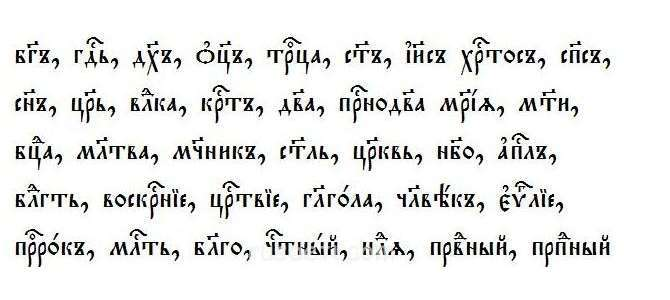

«Б-г» — в смысле «бог». Кто и зачем так пишет — и надо ли так?

Вижу, как православные верующие употребляют на письме сокращение «б-г» — в значении «бог», а вернее, «Бог». Так, и только так. А когда их собеседник отказывается делать так же, обвиняют его в кощунстве. Напрасно. Кощунства здесь нет. Нет и почтения к трансцендентному началу. Объясню почему.

Эрративы, или умышленно искажённые орфографически формы имён Всевышнего, приняты в иудаизме и используются в тех случаях, если возникает риск, что написаное будет стёрто или осквернено иначе. Так, в части имён заменяют букву ה буквой ק.

Применительно к ивриту требование безоговорочное. В отношении других языков суждения еврейских богословов расходятся. Но часто верующим иудеям рекомендуется придерживаться общего принципа, на каком бы языке они ни писали. В русском главным модификатором такого рода служит дефис. Будучи начертанными через дефис, по талмудической логике эти слова утрачивают прямую связь с высшим вселенским началом и, следовательно, святость.

Хотя иудаизм — религия авраамического дискурса, предписания цадиков и ребе ни на католиков, ни на протестантов, ни на православных не распространяются. **В православии аналогичного требования нет.**

Теперь — к светскому и к грамматике. Говорю без всякого желания оскорбить чью-либо веру: на мой взгляд, употребление табуизма «б-г», тем более вне круга верующих, и его якобы миссионерское насаждение — от архаического, или магического, мышления. От чувства смежности in oratiōne — in vītā, «как в речи, так и в жизни». Дескать, напишу через чёрточку — и слово перестанет быть обращением к отцу небесному и не окажется сказанным всуе. Однако подобное мировосприятие ближе к языческому.

**Сакрализация речевой единицы здесь мнимая.** Действовать, бывает, и действует, но лишь когда читающий:
- столь же истово верующий;
- разделяет, по-умному говоря, коммуникативную стратегию пишущего.

> Между тем из первого не обязательно вытекает второе.

А откуда вообще взялось «б-г» — от правоверных евреев? Нет. Это неудачная замена, с невольной вульгаризацией, куда более старого «бг҃ъ» в церковнославянском, в котором диакритический знак титло маркировал, в частности, священные объекты и сущности в сокращённом написании.

По факту же в современном русском языке высечение срединной части слова с постановкой дефиса при обозначении субъекта, фигуры никоим образом не выражает уважения, тем более трепета, а означает обыкновенно:
- официальный или даже бюрократический регистр речи;
- потребность сократить высказывание из утилитарных соображений, например ввиду малозначимости или условности полного обращения.

«Въ нача́лѣ сотворѝ бг҃ъ не́бо и зе́млю» — вот в таком контексте сокращение ок. А «б-г всё видит» ничем не лучше, чем «г-н Недланопожатский, к директору». Вере ни к чему вериги канцелярщины.