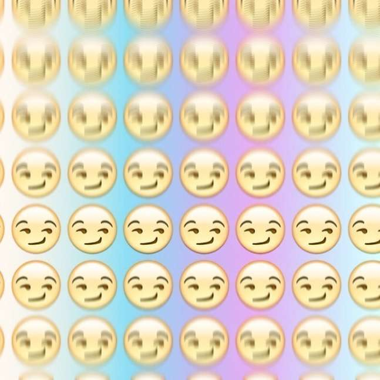

Объясняем, как употреблять смайлики вместе с традиционными знаками препинания. Когда вместе, когда вместо. И почему лучше так, а не иначе.

Материал не о смайликах как таковых, а о том, как их правильно оформлять на письме с точки зрения внутренней логики русского языка. В частности, должны ли они «прилипать» к словам и к другим знакам препинания, и если да, то как и при каких условиях.

## Называть ли смайлик смайликом?

Открывает статью намеренно допущенная неточность. Намеренно не намеренно — исправляемся. Лингвистической строгости ради следовало бы вынести в заголовок менее распространённый термин «эмотикон» — от англ. emotion и icon, «эмоция» и «пиктограмма» соответственно. То есть пиктограмма, обозначающая эмоцию.

Между тем «смайл» — название обиходное и изначально относится исключительно к стилизованному изображению улыбающегося лица. Для пуриста «гневный смайл» — несуразица, оксюморон. Мы не пуристы, поэтому, как и вы, с чистой совестью говорим так: в русском языке слово ресемантизировалось — утратило исходное значение и обрело новое.

Далее в тексте под «смайлом» или «смайликом» будет подразумеваеться только тот эмотикон, который составлен из типографских знаков. Графический, рисованный — дело иное. Такие ближе к мини-иллюстрациям, семиотически более автономны, почти не поддаются унификации, да и не нуждаются в ней. Куда там, когда в каждой соцсети свой набор «весёлых картинок», как правило уравнивающий смайлы с другими пиктограммами, идеограммами, символами и чёртом в ступе.

Пока использование смайликов правилами русского языка никак не регулируется и в ближайшие годы едва ли будет. Всё-таки, укоренившись в неформальной интернет-коммуникации, эмотиконы редко попадают в другие речевые регистры и жанры иначе как в виде исключения. Так что в своих рассуждениях мы исходим из трёх критериев.

По убыванию значимости:
* языковая логика;
* прецедентная практика;
* мнения экспертов-лингвистов.

#### Переведи мне смайл

Смайлы, по крайней мере текстовые, не универсальное внеязыковое выразительное средство. Хотя они зримо передают информацию [первой сигнальной системы](https://ru.wikipedia.org/wiki/%D0%A1%D0%B8%D0%B3%D0%BD%D0%B0%D0%BB%D1%8C%D0%BD%D0%B0%D1%8F_%D1%81%D0%B8%D1%81%D1%82%D0%B5%D0%BC%D0%B0), но подчиняются законам второй сигнальной системы с её условностями. Поди догадайся, что означает такой корейский эмотикон:

(-_-メ) («Очень рассержен», здесь メ — это морщины на лице)

### Логика улыбки

Плясать будем от теоретической подоплёки. От теоретической подоплёки плясать вовсе не скучно. Вслед за сведущими в предмете учёными-лингвистами мы склоняемся к тому, что текстовые смайлы, со скидкой на ограниченную сферу их употребления, тяготеют к превращению в знаки пунктуации. Пусть и доселе невиданные. Редакция «Гзома» с головой ушла в кандидатскую диссертацию М. С. Школовой «Лингвистические и семиотические аспекты конструирования идентичности в электронной коммуникации», где это утверждение убедительно доказывается.

Право, едва ли кто-то видит рядовой, без изысков, смайлик буквально как улыбку собеседника, да ещё воспринимает его в отдельности от высказывания. Он часть «служебной разметки» текста. Наш взгляд скользит по стандартным :) и =) и задерживается на них разве что чуть дольше, чем на запятых.

Фактически текстовые эмотиконы способны выполнять обе главные роли регулярных знаков препинания — синтаксическую и интонационную. С одной стороны, организуют структуру текста, прежде всего разделяют фрагменты речи. С другой — служат передаче смыслов, и в том числе тех, которые непереводимы в вербальную плоскость. Чего только не умеют эти схематические рожицы. Например, задавать или уточнять модальность высказывания.

> Хочу лимузин с салоном как красный вигвам в «Твин Пикс».  
> Хочу лимузин с салоном как красный вигвам в «Твин Пикс» ヅ

#### Разомнём для ясности

Модальность — это понятийная категория, которая характеризует:

1. отношение говорящего к содержанию высказывания;
2. или статус обозначенной в нём ситуации по отношению к реальному миру;
3. или <…> коммуникативную цель говорящего.

> В грамматике модальность выражается прежде всего наклонением. Например, в предложении Не уверен, что Маша пришла бы сослагательное наклонение выражает тот факт, что ситуация прихода Маши является гипотетической, а не реальной. В предложении Вот бы пришла Маша! сослагательное наклонение выражает желательность той же ситуации для говорящего. В предложении Уходи, Маша! повелительное наклонение выражает побуждение к действию.
> 
> _Е. В. Падучева, 2014_

Где смайл, там пауза, короткая или длинная. Причём в одном случае он встаёт в «зазор», в другом, наоборот, «зазор» создаёт, в третьем — и то и другое в диалектическом единстве. Обозначение конца фразы и менее крупных отрезков речи — такая же важная и постоянная функция смайлика, как и передача экспрессии в коммуникации.

Следовательно, подобно знакам препинания, эмотиконы целесообразно оформлять на письме по общим принципам — для упрощения «служебной разметки» речи. Чтобы смайлики легко вычленялись из текста, ритм чтения не сбивался и сразу становилось ясно, к чему они относятся.

В отношении встречи эмотиконов с какими бы то ни было элементами текста устоявшихся норм, повторимся, на сегодняшний день нет — ни грамматических, ни этикетных. Поэтому мы лишь предлагаем свои, с нашей точки зрения внутренне непротиворечивые. Теперь подробнее о них.

По нашему выстраданному мнению, от любого знака с любой стороны смайлики надлежит отделять пробелом. Причиной тому их пиктографическая — «картиночная» — природа. К тому же в русской пунктуации существуют эмоциональные маркеры, которые могут относиться к конкретному слову или фрагменту речи и отбиваются с двух сторон пробелами, например (!):

> «Отдых вышел, по словам Арсения, познавательный (!) и активный. Что же он познал, выходя из отеля, только когда в мини-баре заканчивались бутылочки? Был ли активен ещё хоть в чём-то?»

Кроме того, будучи сочетанием типографских знаков, по большей части знаков препинания, смайлик, поставленный вплотную к точке или, например, восклицательному знаку, волей-неволей ассимилирует его, например: !=) Что это было — восклицательный знак в связке с эмотиконом или смайл ко Дню ВДВ?

Возможно, отступление от общих закономерностей допустимо для смайла, редуцированного до одной круглой скобки или их последовательности: ну вот например)))) Ведь с усечением пиктограммы — ни «носа», ни «глаз» — её уровень абстракции возрастает. Вплоть до того, что присущ нормативным знакам пунктуации. Это без пяти минут знак — именно знак, закреплённая общественным договором условность, из графического решения которой проблематично восстановить её смысл: что, кроме опыта, заставляет нас приписывать восклицательному знаку экспрессивность? То же со скобкой-смайликом: поди догадайся без знания об эмотиконах, что она призвана передавать улыбку.

Точку смайлик поглощает. Во-первых, его наличие по определению противоречит ровной повествовательной интонации, во-вторых, он вступает в действие принцип экономии графических средств, подобно тому как в пунктограмме ?!. оказывается «съеденным» многоточие, а при столкновении двух однонаправленных кавычек одинакового рисунка «в живых остаётся только одна» — см. начало предложения:

> «Цыганы» мои не продаются вовсе», — сетовал Пушкин.

Ещё стоит держать в уме, что смайлики до сих пор используются главным образом в неформальной цифровой коммуникации, в которой негласные коммуникативные нормы вопреки правилам пунктуации предписывают неупотребление точки в повествовательных предложениях с нейтральным или доброжелательным посылом.

При стечении эмотикона и, например, вопросительного или восклицательного знака приоритет у второго, и ставится тот раньше:

> Куда только смотрит ФСКН? ;) А, простите, больше ведь никуда не смотрит! =)

Логично: смайлик относится ко всей фразе с её базовыми интонационными характеристиками.

### Как оформлять смайлики на письме

Эмотикон любого вида отбивается пробелом от последнего слова отрывка речи, к которому относится. Оптимально с точки зрения типографики — неразрывным пробелом.

**Хорошо:**
_Однако %) Умеешь ты удивить :)_

**Плохо:**
_Разделяй и властвуй;)_

При столкновении текстового смайла с точкой он её поглощает и заменяет.

**Хорошо:**
_У меня последняя неделя — страх и ненависть в Ватутинках :)_

**Плохо:**
_Вы б, газели, не галдели. :-)_
    
Если нужно поставить текстовый смайлик в конце предложения, завершающегося любым нормативным знаком препинания, кроме точки (восклицательным или вопросительным знаком, либо их сочетанием, либо многоточием т. д.), его место — после такового, через пробел.

**Хорошо:**
_— Ну ты и шкура… ;) — Я?! o__o_

**Плохо:**
_Но мой плот вовсе не так уж плох!..:)_
  
Вопросительный и восклицательный знаки никаким смайликом заменять не следует: эмотиконы, даже те анимированные графические, которые способны передать чувство озадаченности или грозный приказной тон, не обладают такой конвенциальностью и считываемостью, как традиционные знаки пунктуации. Ту же рекомендацию даёт Максим Кронгауз в «Самоучителе олбанского».

Когда текстовый смайлик завершает конструкцию в круглых скобках и должен оканчиваться такой скобкой сам, скобка ставится лишь одна. Если их будет две, читатель того и гляди решит, будто вторая тоже целиком относится к смайлику и усиливает его. А сам эмотикон в полном соответствии с предыдущими рекомендациями отбивается слева пробелом.

**Хорошо:**
_Граждане, храните деньги в сберегательной кассе (если, конечно, они у вас есть :)_

**Плохо:**
_«Не гонялся бы ты, поп (священнослужитель. — Прим. ред. :)), за дешевизной»._

Усечённый текстовый смайл из одной или нескольких однонаправленных скобок может как примыкать к слову или знаку пунктуации, так и отбиваться от них пробелом. Главное — выбрать один из двух способов оформления эмотикона и придерживаться его в пределах текста. Первый, на наш взгляд, чуть фривольнее.

**Хорошо:**
_Люблю запах напалма поутру) Это запах победы)))_

**Или:**
_Траурный мячик дешёвого мира )) Пластмассовый мир победил! ))_
  
После двоеточия или точки с запятой ставить эмотикон из типографских знаков нежелательно: во-первых, возникает каша, во-вторых, смайлик разрушает синтаксическую связь, которую те создают. В конце концов, даже в неформальной речи эмотиконы не везде применимы по причинам чисто грамматическим.

**Оптимально:**
_Дело было так: поехали мы в Брно…_

**Тоже возможно:**
_Дело было так =) Поехали мы в Брно…_

**Уже хуже, неестественно:**
_Дело было так: =) поехали мы в Брно…_

**Совсем плохо:**
_Дело было так:=) поехали мы в Брно…_
