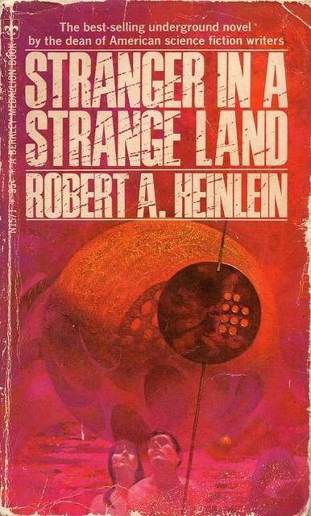
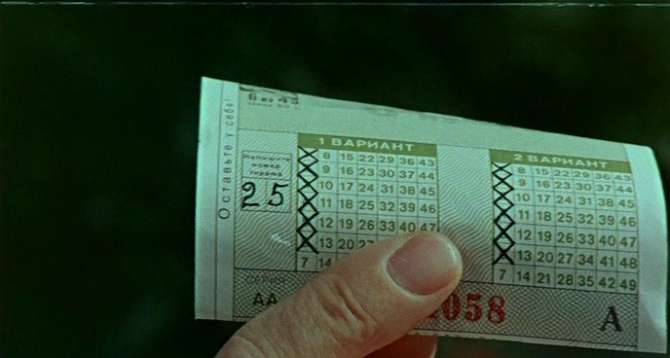

Три редких «выдуманных» слова, которые иногда очень к месту.

Рукотворная, создаваемая литераторами лексика проникает в наш языковой обиход сколь деликатно, столь и непредсказуемо. И укореняется там, где обнаруживается потребность в ней. О «художественном» происхождении слова, получившего широкое хождение, догадаться бывает трудно. Уже не самое редкое, например по сравнению с серединой XX века, женское имя Стелла тоже плод вымысла: предположительно, придумал его английский поэт Филип Сидни (1554–1586), чьему перу принадлежит цикл сонетов «Астрофил и Стелла», и образовано оно от латинского stella — «звезда».

В Союзе большую популярность имени обеспечили, скорее всего, братья Стругацкие, назвав так «молоденькую ведьму-практиканту» в повести «Понедельник начинается в субботу», за границей матери начали массово давать его дочерям после премьеры фильма «Трамвай „Желание“» с Марлоном Брандо и Вивьен Ли.

У имени Стелла был прообраз в европейской культуре. На юге Франции издавна почитается жившая в III веке н. э. святая мученица Эстель, в русской традиции — Евстелла. Нарекли её, вероятно, держа в уме древнегреческое ευσταλες — или eustales, «добротно одетая», «опрятная». С лёгкой руки провансальского поэта XIX века Федери Мистраля благочинное имя с эллинскими корнями превратилось в романтическое: Eustalia → Estelle. Стихотворец приблизил его к окситанскому estela — «звезда». Возможно, как раз под влиянием Филипа Сидни.

Ну да то имя собственное. Иное дело имена нарицательные, существованием которых мы обязаны чьему-то лингвистическому творчеству. Обычно таковые призваны означать то, чего в реальности нет. Или _ещё нет_. Фантастическим вещам — фантастические названия. Про то, что «робот» — творение Карела Чапека, а «лилипут» выдуман Свифтом, знают многие, и эти неологизмы уже и в русском языке быть неологизмами давно перестали. Зловещих [«атарков»](https://ru.wikipedia.org/wiki/%D0%94%D0%B5%D0%BD%D1%8C_%D0%B3%D0%BD%D0%B5%D0%B2%D0%B0_(%D1%84%D0%B8%D0%BB%D1%8C%D0%BC,_1985)) советского фантаста Севера Гансовского, хоррор-версию булгаковского Шарикова, — вспоминают куда реже.

Есть, однако, слова, которые и в английском не стали общеупотребительными, по крайней мере пока, но людям начитанным известны и очень ёмко определяют явления с двоякой сущностью: сразу не скажешь, были ли они до того, как о них написали. Теперь — точно есть. И иногда норовят прыгнуть на язык, потому что иначе ты будешь вынужден, прокашлявшись, изречь нечто вроде: «Ну, грокк — это когда…» — и следом целая речь.

### Грок

Отец «грока» — американский фантаст Роберт Хайнлайн. Он вложил это слово — оно фигурирует и как существительное, и как глагол — в уста Смита, главного героя романа «Чужак в чужой стране» (1961), марсианского Маугли, который был воспитан жителями четвёртой от Солнца планеты и послан на Землю, чтобы понять, точнее, грокнуть её и разобраться, как с ней быть.

Вкратце «грок» — это когда ты глубинном уровне, полностью и всеохватно, понял нечто, пропустив его через себя, сделав его частью себя, без побочных допущений и рационализации. В романе исходное значение слова «грокать» включает ещё один смысл — «делать понятое доступным для коллективного опыта»: марсианская цивилизация у Хайнлайна владеет телепатией, и её представители способны напрямую разделять опыт друг друга, внося его в общий багаж знаний. В марсианском языке «грок» ещё и «вода», «пить», «жизнь»; вода — самый ценный ресурс на Красной планете. Один из героев книги сумел «грокнуть» сам «грок» настолько, насколько вообще способен землянин:

> – Марсиане, похоже, инстинктивно знают то, что мы с таким трудом взяли от собственной физики: наблюдатель влияет на объект наблюдения посредством самого процесса наблюдения. «Грокнуть» означает понять так полно, что наблюдатель становится частью объекта наблюдения: поглощается, смешивается, всасывается, теряет индивидуальность в групповом познании.
> 
> _Р. Хайнлайн, «Чужак в чужой стране»_

Примечательны — и ожидаемы — трудности, с которыми столкнулись переводчики «Чужака в чужой стране». Одна фраза из его первых глав передана В. П. Ковалевским и Н. П. Штуцер так: «Столько надо было грокнуть, а начинать приходилось почти что с нуля». Иначе у М. А. Пчелинцева: «Как много ещё неогроканного и как мало твёрдых, надёжных основ для гроканья». Смотрим в оригинал: ‘He wished that his brother Doctor Mahmoud were here. There was so much to grok, so little to grok from’. Здесь подразумевается примерно следующее: «Ему хотелось, чтобы его брат доктор Махмуд был рядом. Столько всего нужно было _грокнуть_, но _грокнуть_ было почти неоткуда». Не случайно Смит сетует на то, что сейчас нельзя вступить в контакт с доктором: лучшая точка входа (to grok from) в «сверхпонимание» — брат по разуму.

Книга сильно повлияла на американскую массовую культуру, и слово успело войти в словари английского языка. Как объясняется в пятом издании American Heritage Dictionary of the English Language, grok значит ‘to understand profoundly through intuition or empathy’. То бишь: «Глубоко познать что-либо посредством интуиции или эмпатии». Определение Оксфордского словаря английского языка более подробное:
- to understand intuitively or by empathy;
- to establish rapport with;
- to empathize or communicate sympathetically (with);
- also, to experience enjoyment.

Приблизительно: «Понимать интуитивно или на основе эмпатии; достигать хорошего, гармоничного контакта с чем-либо или кем-либо; взаимодействовать с чем-либо через сопереживание, а также испытывать удовольствие». При попытке выразить всё стоящее за односложным словом «грок» мы будем вынуждены поднять целый пласт понятий, как то: эмпатия, безоценочность, точное и полное знание, отсутствие искажений под влиянием личного опыта, наслаждение от глубинного познания.

С первоисточником знакомы хорошо если два-три процента русскоговорящих, поэтому и про «грок» у нас мало кто знает. В то же время другие слова литературного происхождения, например «маниловщина», употребляются сплошь и рядом и в пояснениях не нуждаются; как-никак «Мёртвые души» входят в программу средней школы.

Самые близкие к «гроку» в современном английском термины — «инсайт» (insight) и «серендипити» (serendipity). Близкие, да о другом. «Инсайт» скорее сродни «озарению»: вспышка осознания, прорыв к сути вещей, который предуготовлен большим подспудным массивом информации. Serendipity для английского, в свою очередь, иноязычное заимствование: оно впервые, по случаю, было употреблено в середине XVIII века английским писателем Хорасом Уолполом и произведено от названия сказочной страны Серендип, которая упоминается в древнеперсидском эпосе и с которой европейцы были знакомы благодаря поэме индийского поэта Амира Хосрова Дехлеви. «Серендипити» — это способность делать точные, прозорливые выводы исходя из фрагментарных наблюдений, интуитивно находить верные ответы на вопросы, которыми ты и не задавался. Но это что-то ближе к «всепроницающей мудрости», тогда как «грок» — осознанный акт разумной деятельности. Можно долго и безуспешно «грокать» (Смит в романе Хайнлайна тщился «грокнуть», почему люди смеются), а «серендипити» — это вжух, и готово.

Телепатией люди не владеют, наши суждения формируются в поле предшествующего опыта, мы «обманываться рады», но иногда нас осеняет с такой ясностью, что впору произнести:

— Я грок твою досаду.

### Карасс

Изданная на два года позже хайнлайновского романа, «Колыбель для кошки» Курта Воннегута изобилует неологизмами. Главный среди них — «карасс» (karass). Это краеугольный камень учения пророка Боконона, которое он и его сподвижник выдумали от и до, чтобы скрасить жизнь аборигенам тропического острова, и в которую туземцы начали истово верить; эта гуманистическая антиутопия способна привести иного читателя к мысли, что, возможно, «религия из пробирки» несёт людям едва ли не больше блага, чем традиционные.

По представлениям боконистов, всё человечество состоит из групп, которые, сами того не ведая, претворяют в жизнь промысел высшей силы. Такая группа, минимум из двух членов, и является карассом. Для неё «не существует ни национальных, ни ведомственных, ни профессиональных, ни семейных, ни классовых преград». Форма её не поддаётся определению, и найти её пределы, как предупреждают священные тексты, невозможно.

> «Если вы обнаружите, что ваша жизнь переплелась с жизнью чужого человека, без особых на то причин, этот человек, скорее всего, член вашего карасса». 
> 
> _К. Воннегут, «Колыбель для кошки»_

Карассу противостоит гранфаллон — мнимый карасс, объединение людей, созданное вне божьего замысла. Те, кто входит в гранфаллон, склонны приписывать ему свойства карасса. В книге как пример ложного карасса приводятся «хужеры» (Hoosiers) — выходцы из штата Индиана, в которых, по мнению одного из героев, «есть нечто особенное».

Как говорил сам Боконон — в переводе Риты Райт-Ковалёвой:

> Что такое гранфаллон, хочешь ты узнать?  
> Надо с шарика тогда плёнку ободрать!

Словарь боконизма пёстр и отсылает нас сразу к нескольким языкам: гавайскому («ранг-ранг»), алгонкинскому («вампитер»), греческому («фома», «калипсо»), романским и германским («гранфаллон»). А сами священные тексты Боконона сочетаются в себе традиции английской литературы нонсенса и мифологию коренного населения Америки.

Этимология фантастического термина, если её не объясняет сам автор, конечно, фикция. Мне в «карассе» слышатся отзвуки английских care и сaress — «забота» и «ласка» соответственно, а заодно и carcass — «остов». Наши дружба и любовь рождаются в сплетениях рационального и иррационального, и «карасс» — подходящая концепция, чтобы помочь нам принять причуды человеческих взаимоотношений. Например, почему дачный друг, с которым ты теперь раз в пару лет играешь на бильярде и чешешь языками, казалось бы, попусту, тебе отчего-то дорог не меньше людей, с которыми ты видишься каждый день и которые разделяют твои взгляды.

### Макгаффин

Самое «легитимное слово» из троицы. Родившись из шутки, «макгаффин» стал термином в рамках нарратологии — дисциплины, изучающей повествование, его типологию, логику, механику. Режиссёр Альфред Хичкок, который и ввёл это слово в киноязык, говорил, что оно взято из анекдота:

> Едут двое в поезде. Один спрашивает:
> — Что это у вас за свёрток на верхней полке?  
> — Мак-Гаффин.  
> — А что это?  
> — Приспособление для ловли львов в горах Шотландии.  
> — Но ведь в горах Шотландии нет львов!  
> — Ну, значит, и Мак-Гаффина нет.  

Обобщённо макгаффин — предмет, вокруг которого закручивается литературный или кинематографический сюжет. Он даёт толчок действию, им мечтают обладать или, реже, от него хотят избавиться значимые для истории герои, и в конечном счёте он, как правило, либо исчезает из повествования, либо перестаёт быть важен на фоне тех перипетий, которые породил. Макгаффин может вернуться, например в кульминации, а может и пропасть с концами. Также это название приёма, который заключается в использовании такого катализатора.

Один из старейших макгаффинов — Святой Грааль. Сначала его считали чашей, в которую капала кровь распятого Христа, в средневековых романах он представал в обличье чудодейственного камня. В дальнейшем его часто понимали как аллегорию духовного совершенства.

Сущность настоящего макгаффина предполагает умолчание — тотальное ли, частичное ли. В каком-то отношении он противоположен гроку: загадку макгаффина герои не в состоянии «грокнуть», понять во всей полноте. Те самые «два ствола» в фильме «Карты, деньги, два ствола» тоже макгаффин: персонажи отдают себе отчёт в том, что перед ними ружья, но большую часть экранного времени понятия не имеют какие.

Содержимое чемоданчика из «Криминального чтива» — мы видим, только как лица героев озаряет сияние, в ракурсе словно бы «глазами сокровища», — самый что ни на есть макгаффин, с изрядным налётом пародийности. Не обязательно это артефакт: полковник Курц в «Апокалипсисе сегодня» — макгаффин для капитана Уилларда и его командиров. «Грок» и «карасс» едва ли осядут в тезаурусе русского языка. Оно и понятно: первейшее утилитарное назначение речи — доносить смыслы с минимумом потерь и с предельной ясностью, а Хайнлайн и Воннегут не у каждого на полке дома или в онлайн-читалке. Но иной раз хочется пробормотать себе под нос:

> — Я не грок макгаффин вашего гранфаллона.